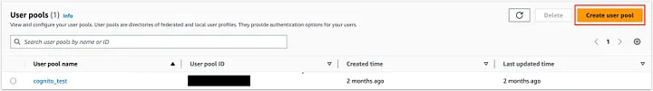

# 0.1. David Mamani

Ingenieria de Sistemas

Tengo experiencia en el desarrollo web y movil

Tecnologias que conozco:

- React

- Django

- Flutter

Mi expectativa del curso es aprender sobre las arquitecturas para diseñar softwares grandes y las mejores practicas para formular una arquitectura apropiada.

En 10 años me veo trabajando como desarrollador en una empresa de software.

# Tema individual

## Pruebas de compatibilidad en dispositivos móviles

Las pruebas de compatibilidad en dispositivos móviles son un proceso importante en el desarrollo de aplicaciones móviles, ya que aseguran que una aplicación, sitio web o software funcione correctamente en una amplia gama de dispositivos, sistemas operativos, tamaños de pantalla y navegadores. El objetivo principal es garantizar que todos los usuarios, independientemente del dispositivo que utilicen, puedan interactuar con la aplicación sin errores o problemas de usabilidad.

### Ejemplos

- Una aplicación que funciona perfectamente en un dispositivo Samsung Galaxy S22 con Android 13, pero que presenta problemas de visualización en un iPhone 12 con iOS 16.

- Una aplicación que responde bien a gestos en un dispositivo táctil, pero no responde correctamente en un dispositivo con una interfaz diferente.

### Aspectos Clave

Para garantizar la robustez de la aplicación móvil, es crucial realizar diversas pruebas. Algunos de los aspectos más comunes que se quiere testear son:

- **Visual**: Algunos navegadores o dispositivos pueden tener dificultades para renderizar ciertos elementos gráficos. Se busca asegurar que la aplicación funcione sin problemas en diferentes dispositivos, tamaños de pantalla y sistemas operativos. Por ejemplo, un programa podría funcionar solo en pantallas con resoluciones específicas a menos que los desarrolladores modifiquen la estructura de los elementos visuales.

- **Funcional**: Se verifican las características y funciones generales de la aplicación, garantizando que el software entregue los resultados esperados en cualquier dispositivo. Por ejemplo, en un sistema de gestión de relaciones con clientes, un sistema operativo obsoleto podría impedir la correcta visualización de datos de ventas o realizar el análisis de esos datos.

- **Rendimiento**: Apunta a garantizar la estabilidad de la aplicación en diferentes dispositivos. Para ello, se evalua la capacidad de respuesta, velocidad y rendimiento general de la aplicación bajo diferentes condiciones. Por ejemplo, se analiza el rendimiento cuando el dispositivo tiene baja batería o conectividad de red deficiente.

### Importancia

- **Identificación temprana de errores:** Ayuda a localizar y corregir errores durante el desarrollo, revelando también problemas de estabilidad y rendimiento que los desarrolladores pueden solucionar para evitar que lleguen al usuario final.
- **Reduccion de costos**
Las pruebas de compatibilidad también pueden reducir los costos del desarrollo de software, ya que ayudan a los equipos a detectar fallas en la app antes de que sea lanzada al público.
- **Alcance a un público más amplio:** Cuanto más exhaustivas sean las pruebas, más dispositivos podrán soportar la aplicación, garantizando que un mayor número de usuarios, desde diversas plataformas, puedan disfrutar del producto.
- **Satisfacción del cliente y reputación:** Un producto de calidad mejora la experiencia del usuario, lo que se traduce en mayor satisfacción y una mejor imagen para la empresa.

### Desafíos del Ecosistema Móvil

El desarrollo de aplicaciones móviles presenta diversos desafíos que deben abordarse para garantizar una experiencia de usuario consistente en una amplia gama de dispositivos y entornos. 

- **Resoluciones de Pantalla**: Los dispositivos móviles vienen en una gran variedad de tamaños de pantalla y densidades de píxeles, lo que puede afectar la forma en que se renderizan las interfaces de usuario. Elementos visuales, como botones, imágenes y textos, pueden verse distorsionados o mal alineados si no se ajustan correctamente a diferentes resoluciones. Por ejemplo, el botón "Enviar" en una aplicación de mensajería puede superponerse al campo de texto en pantallas pequeñas.

- **Sistemas Operativos y Versiones**: Las aplicaciones deben adaptarse a múltiples versiones de sistemas operativos, especialmente Android e iOS. Adicionalemnte, las funcionalidades disponibles y el comportamiento del sistema pueden variar significativamente entre versiones antiguas y nuevas, lo que dificulta aún más desarrollar aplicaciones compatibles. Por ejemplo, la función de navegación por GPS podría no funcionar en versiones antiguas de Android.

- **Comportamiento del Hardware**: La diversidad de hardware en los dispositivos móviles, como diferentes procesadores, capacidades de memoria y características específicas (como sensores y cámaras), puede influir en el rendimiento de la aplicación. Algunas funciones de la aplicacion incluso pueden depender de hardware que no están presente en todos los dispositivos, lo que puede limitar la experiencia del usuario. Por ejemplo, las funcionalidades de realidad aumentada puede fallar en dispositivos con cámaras de baja calidad.

## BrowserStack

BrowserStack es una plataforma de pruebas basada en la nube que permite a los desarrolladores y testers realizar pruebas de aplicaciones web y móviles en dispositivos reales. A diferencia de los emuladores, que pueden no representar de manera precisa la experiencia del usuario final, BrowserStack proporciona acceso a dispositivos físicos reales, asegurando resultados más exactos y replicables.

### Tipos de Pruebas Soportadas

- **Pruebas Manuales**: Los testers interactúan directamente con la aplicación en un dispositivo real a través de una interfaz basada en la web. Esto es útil para detectar problemas visuales y de usabilidad.

- **Pruebas Automatizadas**: BrowserStack permite la integración con frameworks como Selenium y Appium para ejecutar scripts de prueba automatizados, facilitando la escalabilidad de pruebas de regresión en múltiples dispositivos de manera rápida.

- **Pruebas Visuales**: Para asegurar que la interfaz de usuario (UI) se vea correctamente en todos los dispositivos, BrowserStack ofrece funcionalidades de pruebas visuales con capturas de pantalla para detectar inconsistencias de diseño.

- **Pruebas de Rendimiento**: Se pueden monitorear el tiempo de carga y el rendimiento de la aplicación en dispositivos específicos, evaluando cómo responde la aplicación en términos de velocidad, manejo de recursos y eficiencia.

### Ventajas

- **Acceso a Dispositivos Reales**: BrowserStack permite realizar pruebas en una amplia gama de dispositivos móviles reales con diferentes versiones de sistemas operativos, eliminando la necesidad de adquirir una infraestructura física de dispositivos, o de depender de emuladores.

- **Pruebas Automáticas y Manuales**: Los desarrolladores pueden realizar pruebas manuales, interactuando con la aplicación en tiempo real, o ejecutar scripts de pruebas automatizadas utilizando frameworks como Selenium y Appium.

- **Facilidad de Integración**: BrowserStack se integra fácilmente con flujos de trabajo de CI/CD y herramientas de automatización, como Jenkins, CircleCI y GitHub Actions.

### Desventajas

- **Costo**: Los planes de pago pueden resultar costosos para pequeñas empresas o proyectos individuales, limitando su accesibilidad.

- **Rendimiento Variable**: Al estar basado en la nube, el rendimiento de BrowserStack puede depender de la disponibilidad de dispositivos y la calidad de la conexión a Internet, lo que podría afectar la experiencia de pruebas.

- **Limitaciones en Variables de los Dispositivos Físicos**: Algunos comportamientos específicos de hardware, como el GPS, acelerómetros o cámaras, así como la duración de la batería, no siempre se pueden probar de manera precisa.

### Configuración

#### 1. Crear una Cuenta en BrowserStack

- Visita el sitio web de [BrowserStack](https://www.browserstack.com/).

- Cree una cuenta nueva completando el formulario de registro

- Seleccione un plan. Para probar funcionalidades básicas, se puede optar por el plan gratuito.

#### 2. Panel de Control

- Abrir el panel de control de BrowserStack. Aquí podrás acceder a diferentes herramientas:

    - **App Live**: Para realizar pruebas manuales

    - **App Automate**: Para realizar pruebas automatizadas y de rendimiento

    - **App Percy**: Para realizar pruebas visuales 

    

#### 3. Pruebas Manuales

- Para realizar pruebas manuales, selecciona la opción **App Live** en el panel de control.

- En la parte de la izquierda, seleccionar la opcion "Uploaded Apps" y se selecciona "Upload" para cargar el archivo .apk, .ipa o .aab de la aplicacion que se quiere testear.

- En la parte de la derecha, escoge el fabricante, el dispositivo junto con la versión del sistema operativo en el que deseas probar tu aplicación.

    

- Al hacer click, se redireccionara a una interfaz donde  primero se cargará el dispositivo movil y, luego de unos segundos, se instalará y abrirá la aplicación seleccionada para comenzar las pruebas interactivas. Cabe resaltar que en el pla gratuito existe un limite de maximo 2 minutos de uso continuo del dispositivo.

    

#### 4. Pruebas Automatizadas

- Para pruebas automatizadas, selecciona **App Automate** en el panel de control.

- Se mostraran las opciones para empezar a realizar las pruebas automaticas utilizando diversos frameworks de testing y en diversos lenguajes de programación. En esta guia se utilizará Appium con Python debido a la facilidad de implementación, por lo que al seleccionar esa opción, se abrirá una guia de configuracion (En la seccion "Integrate your test suite"). Cabe resaltar que se requiere tener instalado python3 y pip3. Es opcional realizarlo dentro de un entorno virtual.

    

1. Establecer credenciales de BrowserStack según las credenciales mostradas al abrir la opcion de Access Key en la barra superior

    ```
    setx BROWSERSTACK_USERNAME "dohop_euvm6W"
    setx BROWSERSTACK_ACCESS_KEY "vWohQwcTUwFxn7x8gp4B"
    set BROWSERSTACK_USERNAME=dohop_euvm6W
    set BROWSERSTACK_ACCESS_KEY=vWohQwcTUwFxn7x8gp4B
    ```

2. Instalar el SDK de Python de BrowserStack e iniciar el proyecto de testing automatizado

    ```
    python3 -m pip install browserstack-sdk
    browserstack-sdk setup --username "dohop_euvm6W" --key "vWohQwcTUwFxn7x8gp4B"
    ```

3. Crear el archivo de configuración de BrowserStack: Crear el archivo browserstack.yml y modificar los campos deseados:

    1. Establecer la aplicacion a testear: En la barra superior, seleccionar Upload App y subir el archivo de la aplicación. Luego de subirse, se asignará un código a la aplicación (que empieza por "bs://"), el cual se deberá ingresar en el archivo de configuración
    
    2. Establecer las plataformas a testear: Usando el ayudante de la guia web, escoger los dispositivos moviles deseados y sus versiones de sistema operativo

    3. Modificar el archivo browserstack.yml: Copiar la configuración arrojada por el ayudante y pegarla en el archivo correspondiente.

4. Escribir el scripts de prueba utilizando el framework elegido: Appium. En el script, se debe localizar elementos, interactuar con ellos, y por último, especificar cuando la prueba será marcada como existosa o fallida.
   
    Para iniciar el driver con Appium, se utiliza el siguiente codigo:
    ```
    from appium import webdriver
    from appium.options.android import UiAutomator2Options
    options = UiAutomator2Options().load_capabilities({})
    driver = webdriver.Remote("http://127.0.0.1:4723/wd/hub", options=options)
    ```

    Para localizar elementos, generalmente se apoya de los ID de Accesibilidad que se les otorga a los elementos de una aplicacion para que personas que utilizan las funciones de accesibilidad del dispositivo movil puedan navegar. Sin embargo, también existe la opción de localizar elementos utilizando su XPATH el cual puede ser obtenido mediante el menú Inspect de App Live. Ambos ejemplos se muestran a continuación:
    ```
    element = driver.find_element(AppiumBy.ACCESSIBILITY_ID, "elemnt_id")
    element = driver.find_element(AppiumBy.XPATH, "/hierarchy/android.widget.FrameLayout/android.widget.EditText[1]")
    ```

    Finalmente, para marcar una prueba como exitosa, se debe establecer el status de la prueba y especificar un motivo y luego enviar dichos datos a la plataforma utilizando el siguiente codigo:
    ```
    executor_object = {
        'action': 'setSessionStatus',
        'arguments': {
            'status': status,
            'reason': reason
        }
    }
    browserstack_executor = 'browserstack_executor: {}'.format(json.dumps(executor_object))
    driver.execute_script(browserstack_executor)
    ```

6. Ejecutar la prueba automatizada
    ```
    browserstack-sdk python <path-to-test-files>
    ```

7. Revisar el detalle y los resultados de la prueba en el dashboard de App Automate. Se muestra información como: los dispositivos testeados, la duración de la prueba y éxito de la prueba.

    

    Al abrir una prueba específica, se dará aun mas detalle de la ejecución de la aplicacion, mostrando informacion como: un video de la ejecución, cronologia de los comandos y uso de recursos como procesador, memoria y bateria.
    
    
    

### Problemas comunes
- **Problemas de Conexión**: Durante las pruebas en tiempo real, si la conexión a internet del usuario no es estable, pueden surgir problemas de latencia o desconexión. En tal caso, se recomienda asegurarse de tener una buena conexión antes de iniciar la prueba.
- **Disponibilidad de Dispositivos**: Dependiendo de la demanda, puede que algunos dispositivos no estén disponibles de inmediato para pruebas y no haya opción mas que esperar un tiempo antes de poder utilizarlos.
- **Incompatibilidad con Dispositivos**: En algunos casos, las versiones de las aplicaciones o sistemas operativos pueden no ser compatibles con la plataforma. Esto se puede mitigar actualizando la versión de la aplicación y ajustándola para que sea compatible con versiones más recientes de los dispositivos.

### Alternativas

#### Sauce Labs

Sauce Labs es una plataforma de pruebas en la nube que se especializa en pruebas automatizadas para aplicaciones web y móviles. Ofrece una infraestructura escalable que permite ejecutar pruebas en paralelo en varios navegadores y dispositivos.

**Pros:**
- Rango similar a BrowserStack en cuanto a navegadores y dispositivos.
- Integración robusta con herramientas CI/CD.
- Centrado en brindar soluciones de pruebas confiables y escalables para empresas.

**Contras:**
- Varios usuarios han experimentado problemas de rendimiento como largos tiempos de carga y disponibilidad limitada de dispositivos.
- Al igual que en BrowserStack, algunas funciones avanzadas pueden resultar costosas.

#### Kobiton

Kobiton es una plataforma centrada en la prueba de aplicaciones móviles, que ofrece pruebas manuales y automatizadas en dispositivos reales. Se destaca por sus características impulsadas por IA, como la generación de scripts de Appium.

**Pros:**
- Funciones avanzadas de automatización y generación de scripts con IA.
- Flexibilidad en las opciones de implementación (privadas, híbridas y on premise) útil para organizaciones con estrictos requisitos de seguridad.
- Planes con mejor relacion costo/beneficio.

**Contras:**
- La cobertura de navegadores es más limitada en comparación con BrowserStack.
- La plataforma es menos intuitiva de utilizar.

## Caso de uso

Se quiere testear la funcionalidad del login de una app desarrollada en Flutter en varios dispositivos Android. Para ello, se utilizará App Automate y se configurará y programará el script de pruebas automatizadas para ejecutar el login en multiples dispositivos.


**Repositorio del proyecto**: [Repositorio](demo)

**Video Demo**: [Video](https://youtu.be/E1wMA9W6Ygw)

## Fuentes
- https://qalified.com/es/blog/como-testear-aplicaciones-moviles/
- https://www.qamakers.com/p/guia-rapida-para-pruebas-en.html
- https://www.zaptest.com/es/pruebas-de-compatibilidad-que-son-tipos-proceso-caracteristicas-herramientas-y-mucho-mas
- https://blog.unguess.io/es/pruebas-de-compatibilidad-de-dispositivos-que-son-y-como-elegir-los-dispositivos-adecuados
- https://appmaster.io/es/glossary/compatibilidad-con-dispositivos-moviles
- https://www.testingit.com.mx/blog/pruebas-compatibilidad-software#:~:text=Las%20pruebas%20de%20compatibilidad%20de%20software%20son%20una%20herramienta%20para,operativo%20y%20el%20navegador%20utilizado.
- https://www.browserstack.com/
- https://medium.com/@future_fanatic/browserstack-vs-sauce-labs-choosing-the-right-testing-platform-a56cef10a6a7
- https://medium.com/@anna_jones/kobiton-vs-browserstack-in-2024-a-comprehensive-comparison-176216e99fab


# Patron Cloud: Gatekeeper

Este patron permite proteger las aplicaciones y los servicios mediante el uso de una instancia dedicada para gestionar solicitudes entre los clientes y la aplicación o el servicio. La instancia valida y filtra las solicitudes, lo que proporciona una capa adicional de seguridad y limita la superficie de ataque del sistema.

## Problema

Los servicios could ofrecen a los usuarios la posibilidad de llamar a APIs que les permiten realizar varias tareas, las cuales suelen acceder a datos y otros servicios para completar la solicitud del cliente. 
Sin embargo, si un usuario malintencionado vulnera el sistema y obtiene acceso al entorno en el que se hostea la aplicación, entonces tanto sus mecanismos de seguridad como el acceso a los datos y otros servicios quedan expuestos. Como resultado, el atacante puede obtener acceso ilimitado a credenciales, claves de almacenamiento, información confidencial y otros servicios.

Por dicho motivo, en entornos de aplicaciones distribuidas en la nube existe la constante necesidad de proteger los servicios y datos sensibles de amenazas externas, como ataques de inyección SQL, secuestro de sesiones (session hijacking), ataques de denegación de servicio (DoS) o vulnerabilidades de cross-site scripting (XSS). Sin una protección adecuada las aplicaciones están expuestas a un mayor riesgo de acceso no autorizado y manipulación indebida de datos. 
Además, a medida que crecen la aplicación junto con los servicios y APIs, el riesgo de comprometer la seguridad también aumenta.

El problema principal que aborda el Gatekeeper pattern es cómo reducir la superficie a la que se le puede realizar un ataque y centralizar la validación y filtrado de las solicitudes antes de que lleguen a los servicios backend.

## Solucion

El Gatekeeper pattern propone una solución mediante la implementación de un intermediario (gatekeeper) que se sitúa entre el cliente y los servicios o APIs protegidos. Con el gatekeeper se puede separar el codigo que es publico hacia los usuarios del codigo que procesa solicitudes y accede a los datos. Este gatekeeper actúa como un guardián que controla y valida todas las solicitudes antes de permitir que lleguen a las aplicaciones backend. Su funcionamiento es similar a un firewall en una red, la cual revisa solicitudes y decide si dejarlas pasar o denegarlas.

La solución implica:

1. Validación y filtrado centralizados: Todas las solicitudes de los clientes pasan primero por el gatekeeper, que se encarga de validar su legitimidad (por ejemplo, verificando encabezados, estructuras de datos, etc.). Solo las solicitudes válidas y seguras se transmiten a los servicios protegidos.

2. Minimización de riesgos: El gatekeeper no contiene información crítica, como claves de acceso o tokens de autenticación, lo que significa que incluso si se compromete, el riesgo es limitado. Este diseño asegura que el gatekeeper no tenga acceso directo a la información sensible, reduciendo el impacto de cualquier potencial violación.

3. Capacidad de rechazo temprano: Solicitudes maliciosas o sospechosas son rechazadas inmediatamente por el gatekeeper, lo que protege al backend de sobrecargas innecesarias y posibles ataques.

4. Protección adicional: Como se ejecuta en un modo con privilegios limitados y no en un modo con todos los privilegios, si es comprometido, no se va a poder acceder directamente a los servicios ni a los datos. Al actuar como una capa de seguridad adicional, reduce la superficie de ataque y mejora la seguridad global del sistema. 

5. Monitoreo y alertas: El gatekeeper debe contar con mecanismos de monitoreo para detectar y alertar sobre intentos de ataques, lo que facilita una respuesta rápida en caso de incidentes de seguridad.

## Casos de aplicacion

- API Management Systems: Empresas que exponen múltiples APIs al público o a otros sistemas suelen utilizar plataformas como Azure API Management o AWS API Gateway, que funcionan como un gatekeeper para proteger sus servicios mediante autenticación, autorización y limitación de tasa.
- Web Application Firewall (WAF): Grandes empresas de tecnología y comercio electrónico como Amazon o Netflix, utilizan firewalls de aplicaciones web (WAF) como parte de sus sistemas de seguridad para proteger aplicaciones web de ataques
- Microservicios en contenedores (Kubernetes y Istio): Organizaciones que utilizan Kubernetes para gestionar microservicios en contenedores a menudo implementan herramientas como Istio o Linkerd para manejar la comunicación entre microservicios proporcionando control sobre el tráfico de red entre microservicios, aplicando políticas de seguridad, y garantizando que solo el tráfico autorizado llegue a los servicios.

## Aplicacion en el trabajo del grupo

En el trabajo, se podria aplicar este patrón para asegurar que todos los accesos a los microservicios pasen primero por un Gatekeeper. Esto se puede implementar utilizando AWS API Gateway junto con Amazon Cognito. API Gateway puede servir como el punto de entrada único, asegurándose de que todas las solicitudes que ingresen a la aplicación estén autenticadas y autorizadas a través de Amazon Cognito, donde se gestiona el inicio de sesión de los usuarios y sus permisos. Esto ayuda a validar la identidad y rol de cada usuario antes de permitir el acceso a los microservicios, manteniendo el sistema seguro.

Además, el patrón Gatekeeper también es útil para proteger la aplicación contra ataques comunes como el DDoS y la inyección de comandos. En AWS, se puede combinar API Gateway con AWS WAF (Web Application Firewall) para monitorear y filtrar tráfico malicioso antes de que llegue a tus microservicios. El Gatekeeper actúa como un filtro de seguridad donde se definen reglas para bloquear peticiones sospechosas o para limitar la tasa de solicitudes, previniendo ataques que podrían afectar la disponibilidad y seguridad de la aplicación.

Sin embargo, al aplicar estos nuevos servicios de AWS, se debe evaluar el costo beneficio de cada uno de ellas, debido a que algunos servicios pueden tener un costo significativo a medida que la aplicación escala y recibe más tráfico. Es fundamental considerar si el valor que aportan en términos de seguridad y rendimiento justifica la inversión, así como explorar alternativas o configuraciones más económicas que ofrezcan un balance adecuado entre costo y funcionalidad.

## Caso de aplicación

Una empresa de fintech lanza una aplicación de banca digital que expone servicios sensibles, como la consulta de saldos y transacciones, a través de microservicios. Debido a la alta sensibilidad de los datos y la necesidad de proteger los servicios contra ataques comunes (como SQL injection, DDoS), la empresa necesita asegurar que solo las solicitudes válidas lleguen a los servicios internos.

## Demo

### 1. Crear y Configurar un API en AWS API Gateway

 Definir la API: En AWS API Gateway, crea una nueva API REST o HTTP. Esta API actuará como el gatekeeper para todas las solicitudes entrantes.
   
Configurar Recursos y Métodos: Agregar los recursos específicos para cada servicio (ej., /saldo, /transacciones) y definir los métodos HTTP correspondientes (como GET, POST) para cada recurso especificando qué operaciones están permitidas.
   
### 2. Autenticación y Autorización con AWS Cognito

En AWS Cognito, se muestran el listado de grupos de usuarios ya existentes, si es que se tiene alguno. Para crear uno nuevo, presione el botón Create user pool



Ahora tendrá que seguir un flujo paso a paso de la configuración del grupo de usuarios.


Step 1: The Sign In Experience

Para nuestro ejemplo, mantendremos todo en la configuración predeterminada, solo marcaremos la opción de inicio de sesión por correo electrónico porque queremos que nuestros usuarios usen sus correos electrónicos al iniciar sesión. Ten en cuenta que no podrá cambiar esta configuración una vez que se cree el grupo de usuarios.

Step 2: Configure security requirements

Configure su política de contraseñas. Puede mantener la política predeterminada de Cognito o configurar la suya propia. En este caso, nos quedaremos con la predeterminada. Además, se elige la opción Sin MFA debido que es posible configurarla en un futuro cuando la aplicación lo requiera. 

Step 3: The Sign Up Experience
Marque la opcion Enable self-registration para que los nuevos usuarios pueden registrarse para una cuenta por sí mismos. También permitiremos que Cognito envíe correos electrónicos de verificación.

Step 4: Configure message delivery
Configure la entrega del correo electrónico de verificación marcando la opción Send email with Cognito. Esto nos permitirá enviar hasta 50 correos electrónicos por día de forma gratuita, sin embargo, para el casdo de una fintech, es posible que se requieran más cantidad de correos.

Step 5: App Integration
Ingrese el nombre de un grupo de usuarios que se creará. Marca la casilla de Use the Cognito Hosted UI, la cual permite crear una interfaz de usuario sencilla que se adapta a todo lo configurado anteriormente, lo cual facilita la integración con el frontend de la aplicacion. Además, se elige la opcion de Public App para asegurarnos de que no se generen Client Secrets y se le pone un nombre a la app. Finalmente, se abren las configuraciones adicionales de autenticación y se agrega ALLOW_USER_PASSWORD_AUTH a los flujos de autenticaicon.

Step 5: Review and create
Revise su configuración y presione crear. Se creará su grupo de usuarios y será redirigido a la lista de sus grupos de usuarios.


Finalmente, para integrar Cognito con API Gateway, se realiza lo siguiente:

- En API Gateway, ir a la sección Authorizers y selecciona Cognito como el tipo de autorizador.
- Configura el Authorizer apuntando al nuevo User Pool creado y selecciona el token ID como método de autenticación.
- Aplica el autorizador a los recursos y métodos deseados en API Gateway para asegurarte de que solo usuarios autenticados accedan a los endpoints.
  
De esta manera, ya se ha agregado una nueva capa de seguridad independiente que autentica a los usuarios y se encarga de que solo los verificados accedan a los servicios.

### 4. Proteccion ante ataques con AWS WAF

En la consola de AWS WAF, selecciona Web ACLs y haz clic en Create web ACL.


Ahora tendrá que seguir un flujo paso a paso de la configuración de la lista de control de acceso a la red.


Step 1: Describe web ACL and associate it to AWS resources

Asigna un nombre descriptivo a la ACL, como FintechAppWebACL y se selecciona la region. En Associated AWS resources, se entra al menu de Add AWS Resources y se selecciona AWS API Gateway y se selecciona el gateway creado en el paso 1 para vincularlo.

Step 2: Add rules and rule groups

En la seccion de reglas, se abre Add rules y en la opcion de Add managed rule groups, la cual es una lista que puede ser accedida mediante AWS Marketplace. Algunos ejemplos son: SQL Injection y Cross-Site Scripting (XSS). Cabe resaltar que algunas rules son gratuitos, otros tienen un plan gratuito con capacidad limitada con la posibilidad de subir a un plan de paga y otros son unicamente mediante una suscripcion pagada mensualmente. Mediante estas reglas, se puede aplicar seguridad a la aplicación de una forma sencilla y mantenida por AWS.


Step 3: Set rule priority

En caso de tener varias reglas, en esta seccion se pueden ordenar y priorizar el orden en el que se toma accion. Esto con la finalidad de que, en caso se detecte alguna, se tome una accion determinada segun la prioridad de la regla.

Step 4: Configure metrics

WAF proporciona capacidades de registro y métricas para mostrar cómo se procesan las solicitudes entrantes. Cada regla se asocia con una metrica de CloudWatch (un servicio de AWS de supervicion de aplicaciones). Tambien se pueden enviar muestras para testear el funcionamiento correcto de las reglas.

Step 5: review and create web ACL

Revise su configuración y presione crear. Se creará el web ACL que maneja las solicitudes y las permite o las deniega según las reglas especificadas. Con ello, se agrega una nueva capa adicional que protege a los servicios de la aplicacion de posibles atacantes.

### Flujo Resumido del Gatekeeper en Operación

Cuando un cliente intenta acceder a un servicio:

1. Validación Inicial: La solicitud pasa por AWS API Gateway, que valida la autenticación con AWS Cognito.
2. Filtrado con AWS WAF: AWS WAF aplica reglas de seguridad para bloquear solicitudes maliciosas de atacantes.
3. AWS API Gateway: La solicitud pasa al API Gateway, que actúa como el punto de entrada principal para todas las APIs de los microservicios.
4. Verificacion con AWS Cognito: API Gateway utiliza Cognito para verificar el token de autenticación que envía el cliente. Si el token es válido, se permite el acceso al servicio.
5. Servicios: Asumen que las verificaciones ya ha sido hecha por los pasos anteriores, por lo que unicamente se encargan de ejecutar la logica del servicio.
6. Respuesta: La respuesta pasa de nuevo por API Gateway y se regresa al cliente.

### Demo en codigo

Otra forma de implementarlo utilizando codigo, sería siguiendo una estructura similar, pero utilizando contenedores Docker y nginx. La forma en la que un cliente se conectaría a los servicios sería la siguiente:


**Repositorio**: [Repositorio](gatekeeper)

**Video**: [Video]([https://youtu.be/E1wMA9W6Ygw](https://youtu.be/PAUvYi04LOg))

Fuentes:
- https://medium.com/@stefansarmir/step-by-step-authorisation-and-authentication-with-aws-cognito-part-1-introduction-and-manual-2d4bdbbf2660
- https://frontegg.com/guides/aws-cognito-user-pool
- https://www.freecodecamp.org/news/how-to-use-aws-cognito-for-user-authentication/
- https://medium.com/@christopheradamson253/securing-your-aws-resources-with-aws-waf-web-application-firewall-710ade585b34
- https://www.reblaze.com/blog/aws-security/how-to-configure-and-use-aws-waf/
- https://medium.com/@piyush-agrawal_80375/steps-to-setup-aws-waf-a52666bb9291
