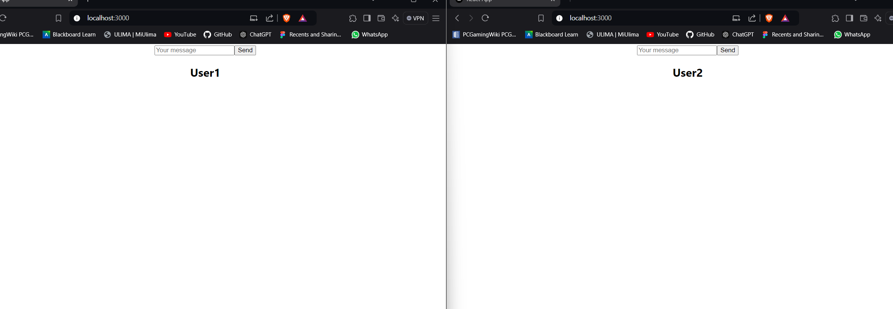
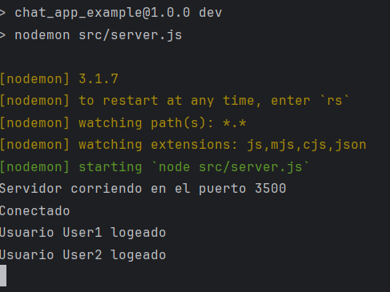
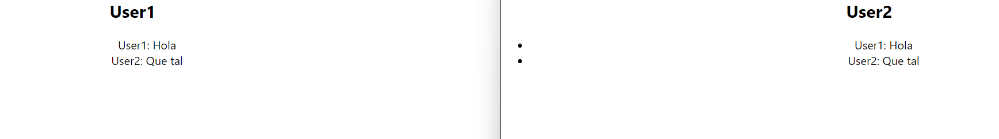

# Nicolas Castro

## ¿Cuál es mi experiencia en desarrollo de software?

Mi experiencia se basa más que todo en proyectos realizados en los cursos de carrera y en las practicas realizadas en el laboratorio de IA de la universidad. Acerca de los proyectos, la mayoria fueron aplicaciones o módulos web aunque también tengo experiencia un poco en aplicaciones móviles.

## ¿Qué tecnologías conozco o domino?

He trabajado con frameworks que utilizan Node.JS como Express o Nest JS utilizando tanto Javascript como Typescript. Para desarrollo front-end, conozco Next JS y React. También he trabajado con Python utilizando Open CV y Flask. Además, he utilizado algunos recursos en Azure para desplegar base de datos y aplicaciones web.

## ¿Cuál es mi expectativa del curso?

Poder comprender como diseñar una arquitectura correcta al momento de desarrollar una aplicaciones y entender cuando y porque utilizar las diversas tecnologías que tenemos disponible para desarrollar.

## ¿Cómo me veo en 10 años?

Trabajando como desarrollador de software junto a un equipo de desarrollo y enseñando temas relacionados a la ingeniería de software. También expandiendo mis conociemientos en nuevas áreas como la computación cuántica.

# Tema individual - Base de datos NoSQL columnares

Están diseñadas específicamente para modelos de datos específicos y almacenan los datos en esquemas flexibles que se escalan con facilidad para aplicaciones modernas. Son fáciles de desarrollar, por su funcionalidad y el rendimiento a escala.

## Apache Cassandra
Cassandra es una de las bases de datos NoSQL que cuenta con un diseño híbrido combinando un almacén tabular y un almacén de claves y valores. Diseñado para almacenar datos para aplicaciones que requieren un rendimiento rápido de escritura. Facebook desarrolló Cassandra en el 2008 y luego la lanzó como un proyecto de código abierto con Apache.

### Características principales

- **Escalabilidad Horizontal:** Cassandra permite agregar nodos fácilmente sin tiempo de inactividad, lo que la hace ideal para aplicaciones que requieren alta disponibilidad.
- **Lenguaje para Consultas:** Cassandra está diseñada para manejar consultas distribuidas y ofrece un lenguaje de consulta similar a SQL llamado CQL (Cassandra Query Language).
- **Es Peer to Peer (P2P):** Permite la replicación de datos en múltiples nodos, lo que aumenta la resiliencia y la disponibilidad de los datos, garantizando que los datos estén siempre disponibles, incluso si algunos nodos fallan.
- **Partition keys:** Es la clave que se utiliza para distribuir los datos entre los nodos del clúster. Aseguran que los datos se distribuyan de manera uniforme, lo que ayuda a mantener un rendimiento óptimo al momento de acceder la información.
- **Clustering keys:** Se utilizan para definir el orden en que se almacenan las filas dentro de una partición. Son claves secundarias que permiten organizar los datos de manera más granular.

### Astra DB
Astra DB es un servicio de base de datos como servicio (DBaaS) proporcionado por DataStax, diseñado para simplificar el uso de Apache Cassandra en la nube.

### Configuración
Para esta demostración se penso en una applicación de mensajeria donde la base de datos servirá para almacenar el contenido de los mensajes enviados.

#### 1. Crear una instancia de base de datos en DataStax Astra DB

- Visitar el sitio web y crear una cuenta [Astra DB](https://www.datastax.com/products/datastax-astra).
- Crear una base de datos y elegiendo el provider y la region más cercana. El keyspace viene a ser el nombre del schema de la base de datos.


#### 2. Crear una tabla para almacenar los mensajes por chat.

- Nos situamos en el CQL console y ejecutamos el siguiente script:
```
CREATE TABLE chat_app.message_by_chat ( 
chat_id UUID, 
message_id TIMEUUID, 
sender TEXT, 
content TEXT, 
sent_at TIMESTAMP, 
PRIMARY KEY (chat_id, sent_at, message_id) ) 
WITH CLUSTERING ORDER BY (sent_at ASC , message_id ASC);
```


**Nota:** En el script estamos indicando que la columna ```chat_id``` va a ser nuestro partition key. Es decir, que la información se va almacenar en cada nodo según el chat_id. ```sent_at``` y ```message_id``` viene a ser los clustering key, los cuales determinaran el orden de la información.

- Generar un token y descargar el Bundle de la base de datos. El bundle es un archivo zip que se tiene ubicar en la raiz el proyecto


- Una vez hecho todo lo anterior pasamos a la construcción de la app.

#### 3. Implementacion de servidor.

Para esta demostración utilizaremos Express JS como framework para el backend y Socket IO para el intercambio de datos de la conversación.

- Para iniciar el servidor primero debemos tener instalada Node JS en nuestras máquinas. Luego inicializamos el proyecto con el siguiente comando:
```
npm init
```

- Luego procedemos a instalar las dependencias de necesarias para el proyecto:
```
npm install body-parser cassandra-driver cors dotenv express socket.io nodemon
```

- Creamos un archivo ``.env`` para almacenar las variables de entorno que utilizaremos para la conexión con la base de datos.

```
ASTRA_DB_SECURE_BUNDLE_PATH=path\de\tu\secure bundle
ASTRA_DB_APPLICATION_TOKEN=tu_token
```

- Para configurar la conexión de la base de datos utilizamos la siguiente configuración:
```
require("dotenv").config()
const cassandra = require("cassandra-driver");

const cloud = { secureConnectBundle: process.env["ASTRA_DB_SECURE_BUNDLE_PATH"] };
const authProvider = new cassandra.auth.PlainTextAuthProvider("token", process.env["ASTRA_DB_APPLICATION_TOKEN"]);
const client = new cassandra.Client({ cloud, authProvider });

async function run() {
  await client.connect();

  console.log("Conectado");
}

run();

module.exports = client;
```
**Nota:** La función ``run()`` no es obligatoria. La utilizamos para probar la conexión. Si la conexión es satisfactoria, podemos comentar la función.

- Podemos declarar un servicio que se encargue de la lógica para el almacenamiento de los mensajes de esta manera
```
const client = require('../config/database');
const TimeUuid = require('cassandra-driver').types.TimeUuid;

exports.sendMessage = async (chatId, sender, content) => {
    const messageId = TimeUuid.now();
    await client.execute('INSERT INTO chat_app.message_by_chat (chat_id, message_id, sender, content, sent_at) VALUES (?, ?, ?, ?, ?)', 
        [chatId, messageId, sender, content, new Date()]);

    return messageId;
};
```
**Nota:** ``cassandra-driver`` recibe los queries en string para poder realizar las consultas con la base de datos.

- Inicializamos el socket de esta manera:
```
const app = require('./app');
const http = require('http');
const socketIo = require('socket.io');

const server = http.createServer(app);
const io = socketIo(server, {
  cors: {
    origin: "*",
    methods: ["GET", "POST"]
  }
});

io.on('connection', (socket) => {
  socket.on("username", username => {
    socket.username = username;
    console.log(`Usuario ${socket.username} logeado`)
  })

  socket.on('message', data => {
    io.emit("message", `${socket.username}: ${data}`)
  });
});

server.listen(3500, () => {
  console.log(`Servidor corriendo en el puerto 3500`);
});
```
**Nota:** Tenemos dos listeners que recibiran y enviarán el nombre del usuario y el contenido del mensaje.

#### 4. Implementacion del cliente
Para el frontend utilizamos el framework React.

- Inicializamos el cliente con el siguiente comando:
```
npx create-next-app@latest
```

- Instalamos las dependencia de Socket IO para el cliente:
```
npm install socket.io-client
```

- Creamos un archivo para la inicialización del socket de esta manera:
```
import { io } from "socket.io-client";

export const socket = io('ws://localhost:3500')
```

**Nota:** La url viene a ser el que se configuró en el servidor. Lo puertos deben ser distintos para que no haya conflictos.

- Creamos un componente llamado App que manejará la interacción de la mensajería.
- Utilizamos los hooks de React ``useState`` y ``useEffect`` para manejar estados y la conexión del socket con el servidor.
```
// Variables de estado para el funcionamiento de la applicación
const [isConnected, setIsConnected] = useState(false);
const [value, setValue] = useState('');
const [messages, setMessages] = useState([]);
const [username, setUsername] = useState("");

//Utilizamos el useEffect para manejar la conexión cuando isConnected es verdadero.
useEffect(() => {
    if (isConnected) {
      function onMessage(data) {
        console.log("Mensaje recibido:", data);
        setMessages(messages => [...messages, data]);
      }

      socket.on("message", onMessage);

      return () => {
        socket.off('message', onMessage);
        socket.disconnect()
      };
    }
  }, [isConnected]);
```

- Guardamos los mensajes en la base de datos al realizar click al boton de enviar:
```
const handleClick = async () => {
    console.log(value)
    socket.emit("message", value)
    setValue('');

    //Llamamos al API con esta función
    const response = await messageAPI.sendMessage({ chatId: chatId, sender: username, content: value })

    if (response) {
      console.log("Mensage guardado");
    }
    else {
      console.log("Error al guardar mensaje");
    }
  }

//messageAPI module.
const url = "http://localhost:3500/api/messages"

const sendMessage = async (payload) => {
  try {
    const response = await fetch(url, {
      method: "POST",
      headers: {
        "Content-Type": "application/json",
      },
      body: JSON.stringify(payload)
    });

    if (response) {
      return response.json();
    }
  }
  catch (err) {
    console.error("Error al mandar mensajes", err);
    return null;
  }
}

const messageAPI = { sendMessage };

export default messageAPI;
```
- Realizamos el diseño que retorna el componente App
```
<div className="App">
    {!isConnected ? (
      <div>
        <input
          type="text"
          placeholder="Enter your username"
          onChange={handleUsernameChange}
        />
        <button onClick={handleUsernameSet}>Set Username</button>
      </div>
    ) : (
      <div>
        <input
          type="text"
          placeholder="Your message"
          onChange={handleChange}
          value={value}
        />
        <button onClick={handleClick}>Send</button>
        <h2>{username}</h2>
      </div>
    )}
    <ul>
      {messages?.map((msg, index) => (
        <li key={index}>{msg}</li>
      ))}
    </ul>
  </div>
```

#### 5. Probando la applicación

- Iniciamos las apps con los siguientes comandos:
```
npm run dev // Para el servidor
npm start // Para el cliente
```
**Nota:** En el package.json del servidor hay que agregar el script para que se ejecute con nodemon, dentro del campo scripts.
```
"dev": "nodemon src/server.js",
```

- Abrimos otra ventana del navegador con la misma url del cliente para realizar la prueba de la convesación.




**Video:** [Link del video](https://drive.google.com/file/d/1ji69vCdu17UE5gDgTFzDqDHQ29Gwm0xR/view?usp=sharing)

**Repo:**[Link del repo](https://github.com/NACB654/chat_app_example.git)

# Patron cloud: Gateway aggregation

## Desarrollo del patron

- **Problema:** En una aplicación donde presenta una arquitectura de microservicios, presenta un problema cuando se realiza una sola tarea. El cliente tiene que hacer multiples llamados a los servicios backend, afectando el impacto al desempeño y escalabilidad de la aplicación. En situaciones donde se utiliza datos móviles, debido a su alta latencia, realizar request individuales llega a ser ineficiente y puede terminar en pérdida de conectividad. En la siguiente imagen se puede ver como una aplicación realiza request a cada servicio y tiene que esperar al response de cada una y procesarlas en conexiones separadas. Esto aumenta el chance de fallos.
  
  

- **Solución:** Implementar un gateway que permite eliminar esa conversación entre el cliente y los diversos microservicios de la aplicación. Este gateway se encarga de recibir todos los request del cliente, enviarselo a cada servicio, recibir los response de cada uno, agrupandolos para finalmente enviar toda la información conjunta al cliente. Este patrón ayuda a reducir la cantidad de request que una aplicación puede realizar, mejorando el desempeño en conectividades con alta latencia.

  

- **Casos de aplicación:** Aplicaciones como **Spotify** utilizan este patrón para acceder a la biblioteca y recomendaciones de canciones para el usuario. Cuando se abre la aplicación el gateway se encarga de obtener la lista de reproduccón, recomendaciones, tendencias, todo en una sola carga.

- **Aplicación dentro del trabajo**: El beneficio de este patron para nuestro trabajo sería la rápidez y bajo uso de recursos cuando solicitemos información de los distintos servicios que tiene nuestra aplicación. Por ejemplo, al iniciar la app, se obtendría en una sola carga, los hábitos ya registrados por el usuario, el mensaje motivador del día generado por la información historica de los habitos realizados previamente,los reportes, información de los amigos todo en una sola carga y mantenerlos en memoria de tal manera que al navegar entre las distintas vistas, estas cargaran de inmediato.

## Demostración

Para esta demostración se utilizó el framework **Express JS** para realizarlo de manera sencilla. Se creó 3 microservicios sencillos, una para mostrar **productos**, otra para los **precios** y el último para mostrar el **inventario**. La información se mostrará dependiendo el **id** del producto. Cada microservicio tiene su propio servidor de **Express JS** y se encuentran en la carpeta *services*.


Cada microservicio tiene su propio puerto y su extructura es de esta manera:
```
// ProductService
const express = require("express");
const app = express();
const PORT = 3003;

app.get("/products/:id", (req, res) => {
  res.json({
    id: req.params.id,
    descriptions: "Producto 1",
  });
});

app.listen(PORT, () => {
  console.log(`Listening at http://localhost:${PORT}`);
});

// PriceService
const express = require("express");
const app = express();
const PORT = 3002;

app.get("/price/:id", (req, res) => {
  res.json({
    price: 100,
    currency: "PEN",
  });
});

app.listen(PORT, () => {
  console.log(`Listening at http://localhost:${PORT}`);
});

// InventoryService
const express = require("express");
const app = express();
const PORT = 3001;

app.get("/inventory/:id", (req, res) => {
  res.json({
    quantity: 26,
  });
});

app.listen(PORT, () => {
  console.log(`Listening at http://localhost:${PORT}`);
});
```

Finalmente desarrollamos el gateway utilizando la dependencia de **axios** para manejar los *requests* de cada servicio y sus *responses* lo ingresamos a una lista utilizando ``Promise.all``.
```
app.get("/gateway/:id", async (req, res) => {
  const id = req.params.id;

  try {
    const productRequest = axios.get(`http://localhost:3003/products/${id}`);
    const priceRequest = axios.get(`http://localhost:3002/price/${id}`);
    const inventoryRequest = axios.get(`http://localhost:3001/products/${id}`);

    const [productResponse, priceResponse, inventoryResponse] =
      await Promise.all([productRequest, priceRequest, inventoryRequest]);

    const data = {
      product: productResponse.data,
      price: priceResponse.data,
      inventory: inventoryResponse.data,
    };

    res.json(data);
  } catch (err) {
    console.error("Error", err);
    res.status(500).json({ message: "Error" });
  }
});
```
Una vez obtenido los *responses*, los enviamos en un json todo junto para que el cliente los reciba.

**Link del demo:** [Repo](https://github.com/NACB654/gateway-aggregation-demo.git)

# Tema individual 2 - Despliegue de LLMs en entornos locales
Los modelos Large Language Model (LLM), son modelos de deep learning muy grandes que requieren una gran cantidad de datos para ser entrenados. Extraen significados de una secuencia de texto y comprenden las relaciones entre las palabras y las frases que contiene. Debido a su complejidad, se necesita una gran cantidad de recursos para correr estos modelos. A diferencia de las redes neuronales recurrentes (RNN) anteriores que procesaban las entradas de forma secuencial, estos modelos pueden procesar secuencias enteras en paralelo.

## Ventajas
- **Privacidad de datos:** Mantiene cualquier tipo de datos sensibles en tu entorno.
- **Independencia de Internet:** Te ahorras el uso de servicios externos.
- **Costos a largo plazo:** Si el modelo se utiliza con frecuencia, resulta ser más rentable que utilizar servicios en la nube como AWS, Azure, etc.
- **Flexibilidad:** Mayor control con el entorno del modelo, incluyendo uso de distintas versiones y dependencias.

## Desventajas
- **Requisitos de hardware:** El desplegar estos modelos requiere de hardware potente el cual puede llegar a ser muy caro.
- **Complejidad técnica:** Al inicia la configuración puede llegar a ser complicada. Además, se requiere experiencia y conocimientos técnicos de los modelos a utilizar.
- **Almacenaminto:** Los modelos suelen tener un gran tamaño de almacenamiento.
- **Escalabilidad:** Este factor llega a ser muy difícil para muchos usuarios debido al gran costo de adquicición de recursos.

## Formas de uso
- Cargando el modelo directamente con el uso de leguajes como Python y frameworks o librerís de IA tales como Pytorch o TensorFlow.
- Utilizando cliente como LM Studio o Jan.

## Demostración con LM Studio
LM Studio es un cliente que te permite cargar cualquier modelo LLM, configurarlo y probarlo con facilidad. Cuenta con conexión vía HuggingFace, un repositorio para modelos LLM, el cual es el que provee los modelos que se descargan.

