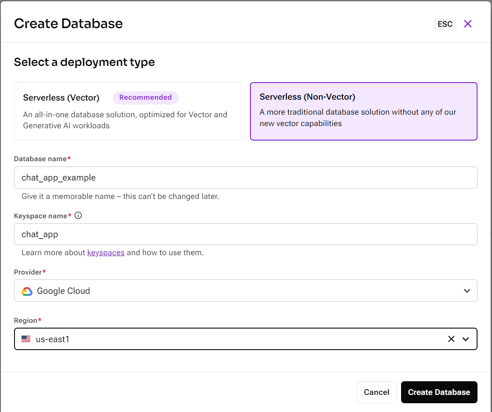
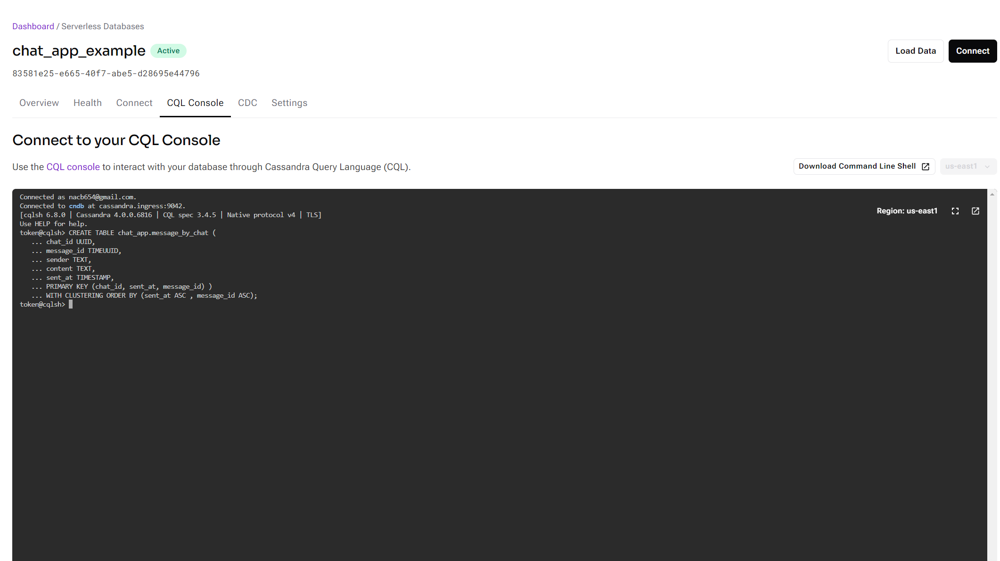
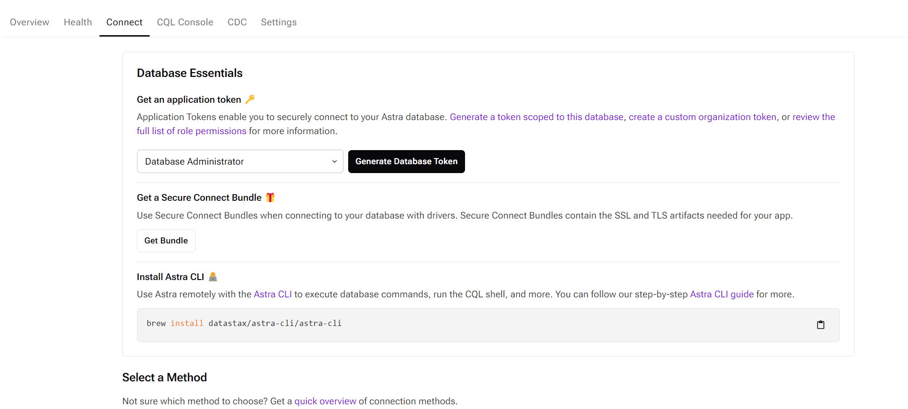

# Nicolas Castro

## ¿Cuál es mi experiencia en desarrollo de software?

Mi experiencia se basa más que todo en proyectos realizados en los cursos de carrera y en las practicas realizadas en el laboratorio de IA de la universidad. Acerca de los proyectos, la mayoria fueron aplicaciones o módulos web aunque también tengo experiencia un poco en aplicaciones móviles.

## ¿Qué tecnologías conozco o domino?

He trabajado con frameworks que utilizan Node.JS como Express o Nest JS utilizando tanto Javascript como Typescript. Para desarrollo front-end, conozco Next JS y React. También he trabajado con Python utilizando Open CV y Flask. Además, he utilizado algunos recursos en Azure para desplegar base de datos y aplicaciones web.

## ¿Cuál es mi expectativa del curso?

Poder comprender como diseñar una arquitectura correcta al momento de desarrollar una aplicaciones y entender cuando y porque utilizar las diversas tecnologías que tenemos disponible para desarrollar.

## ¿Cómo me veo en 10 años?

Trabajando como desarrollador de software junto a un equipo de desarrollo y enseñando temas relacionados a la ingeniería de software. También expandiendo mis conociemientos en nuevas áreas como la computación cuántica.

# Tema individual - Base de datos NoSQL columnares

Están diseñadas específicamente para modelos de datos específicos y almacenan los datos en esquemas flexibles que se escalan con facilidad para aplicaciones modernas. Son fáciles de desarrollar, por su funcionalidad y el rendimiento a escala.

## Apache Cassandra
Cassandra es una de las bases de datos NoSQL que cuenta con un diseño híbrido combinando un almacén tabular y un almacén de claves y valores. Diseñado para almacenar datos para aplicaciones que requieren un rendimiento rápido de escritura. Facebook desarrolló Cassandra en el 2008 y luego la lanzó como un proyecto de código abierto con Apache.

### Características principales

- **Escalabilidad Horizontal:** Cassandra permite agregar nodos fácilmente sin tiempo de inactividad, lo que la hace ideal para aplicaciones que requieren alta disponibilidad.
- **Lenguaje para Consultas:** Cassandra está diseñada para manejar consultas distribuidas y ofrece un lenguaje de consulta similar a SQL llamado CQL (Cassandra Query Language).
- **Es Peer to Peer (P2P):** Permite la replicación de datos en múltiples nodos, lo que aumenta la resiliencia y la disponibilidad de los datos, garantizando que los datos estén siempre disponibles, incluso si algunos nodos fallan.
- **Partition keys:** Es la clave que se utiliza para distribuir los datos entre los nodos del clúster. Aseguran que los datos se distribuyan de manera uniforme, lo que ayuda a mantener un rendimiento óptimo al momento de acceder la información.
- **Clustering keys:** Se utilizan para definir el orden en que se almacenan las filas dentro de una partición. Son claves secundarias que permiten organizar los datos de manera más granular.

### Astra DB
Astra DB es un servicio de base de datos como servicio (DBaaS) proporcionado por DataStax, diseñado para simplificar el uso de Apache Cassandra en la nube.

### Configuración
Para esta demostración se penso en una applicación de mensajeria donde la base de datos servirá para almacenar el contenido de los mensajes enviados.

#### 1. Crear una instancia de base de datos en DataStax Astra DB

- Visitar el sitio web y crear una cuenta [Astra DB](https://www.datastax.com/products/datastax-astra).
- Crear una base de datos y elegiendo el provider y la region más cercana. El keyspace viene a ser el nombre del schema de la base de datos.



#### 2. Crear una tabla para almacenar los mensajes por chat.

- Nos situamos en el CQL console y ejecutamos el siguiente script:
```
CREATE TABLE chat_app.message_by_chat ( 
chat_id UUID, 
message_id TIMEUUID, 
sender TEXT, 
content TEXT, 
sent_at TIMESTAMP, 
PRIMARY KEY (chat_id, sent_at, message_id) ) 
WITH CLUSTERING ORDER BY (sent_at ASC , message_id ASC);
```


**Nota:** En el script estamos indicando que la columna ```chat_id``` va a ser nuestro partition key. Es decir, que la información se va almacenar en cada nodo según el chat_id. ```sent_at``` y ```message_id``` viene a ser los clustering key, los cuales determinaran el orden de la información.

- Generar un token y descargar el Bundle de la base de datos. El bundle es un archivo zip que se tiene ubicar en la raiz el proyecto


- Una vez hecho todo lo anterior pasamos a la construcción de la app.

#### 3. Implementacion de servidor.

Para esta demostración utilizaremos Express JS como framework para el backend y Socket IO para el intercambio de datos de la conversación.

- Para iniciar el servidor primero debemos tener instalada Node JS en nuestras máquinas. Luego inicializamos el proyecto con el siguiente comando:
```
npm init
```

- Luego procedemos a instalar las dependencias de necesarias para el proyecto:
```
npm install body-parser cassandra-driver cors dotenv express socket.io nodemon
```

- Creamos un archivo ``.env`` para almacenar las variables de entorno que utilizaremos para la conexión con la base de datos.

```
ASTRA_DB_SECURE_BUNDLE_PATH=path\de\tu\secure bundle
ASTRA_DB_APPLICATION_TOKEN=tu_token
```

- Para configurar la conexión de la base de datos utilizamos la siguiente configuración:
```
require("dotenv").config()
const cassandra = require("cassandra-driver");

const cloud = { secureConnectBundle: process.env["ASTRA_DB_SECURE_BUNDLE_PATH"] };
const authProvider = new cassandra.auth.PlainTextAuthProvider("token", process.env["ASTRA_DB_APPLICATION_TOKEN"]);
const client = new cassandra.Client({ cloud, authProvider });

async function run() {
  await client.connect();

  console.log("Conectado");
}

run();

module.exports = client;
```
**Nota:** La función ``run()`` no es obligatoria. La utilizamos para probar la conexión. Si la conexión es satisfactoria, podemos comentar la función.

- Podemos declarar un servicio que se encargue de la lógica para el almacenamiento de los mensajes de esta manera
```
const client = require('../config/database');
const TimeUuid = require('cassandra-driver').types.TimeUuid;

exports.sendMessage = async (chatId, sender, content) => {
    const messageId = TimeUuid.now();
    await client.execute('INSERT INTO chat_app.message_by_chat (chat_id, message_id, sender, content, sent_at) VALUES (?, ?, ?, ?, ?)', 
        [chatId, messageId, sender, content, new Date()]);

    return messageId;
};
```
**Nota:** ``cassandra-driver`` recibe los queries en string para poder realizar las consultas con la base de datos.

- Inicializamos el socket de esta manera:
```
const app = require('./app');
const http = require('http');
const socketIo = require('socket.io');

const server = http.createServer(app);
const io = socketIo(server, {
  cors: {
    origin: "*",
    methods: ["GET", "POST"]
  }
});

io.on('connection', (socket) => {
  socket.on("username", username => {
    socket.username = username;
    console.log(`Usuario ${socket.username} logeado`)
  })

  socket.on('message', data => {
    io.emit("message", `${socket.username}: ${data}`)
  });
});

server.listen(3500, () => {
  console.log(`Servidor corriendo en el puerto 3500`);
});
```
**Nota:** Tenemos dos listeners que recibiran y enviarán el nombre del usuario y el contenido del mensaje.

#### 4. Implementacion del cliente
Para el frontend utilizamos el framework React.

- Inicializamos el cliente con el siguiente comando:
```
npx create-next-app@latest
```

- Instalamos las dependencia de Socket IO para el cliente:
```
npm install socket.io-client
```

- Creamos un archivo para la inicialización del socket de esta manera:
```
import { io } from "socket.io-client";

export const socket = io('ws://localhost:3500')
```

**Nota:** La url viene a ser el que se configuró en el servidor. Lo puertos deben ser distintos para que no haya conflictos.

- Creamos un componente llamado App que manejará la interacción de la mensajería.
- Utilizamos los hooks de React ``useState`` y ``useEffect`` para manejar estados y la conexión del socket con el servidor.
```
// Variables de estado para el funcionamiento de la applicación
const [isConnected, setIsConnected] = useState(false);
const [value, setValue] = useState('');
const [messages, setMessages] = useState([]);
const [username, setUsername] = useState("");

//Utilizamos el useEffect para manejar la conexión cuando isConnected es verdadero.
useEffect(() => {
    if (isConnected) {
      function onMessage(data) {
        console.log("Mensaje recibido:", data);
        setMessages(messages => [...messages, data]);
      }

      socket.on("message", onMessage);

      return () => {
        socket.off('message', onMessage);
        socket.disconnect()
      };
    }
  }, [isConnected]);
```

- Guardamos los mensajes en la base de datos al realizar click al boton de enviar:
```
const handleClick = async () => {
    console.log(value)
    socket.emit("message", value)
    setValue('');

    //Llamamos al API con esta función
    const response = await messageAPI.sendMessage({ chatId: chatId, sender: username, content: value })

    if (response) {
      console.log("Mensage guardado");
    }
    else {
      console.log("Error al guardar mensaje");
    }
  }

//messageAPI module.
const url = "http://localhost:3500/api/messages"

const sendMessage = async (payload) => {
  try {
    const response = await fetch(url, {
      method: "POST",
      headers: {
        "Content-Type": "application/json",
      },
      body: JSON.stringify(payload)
    });

    if (response) {
      return response.json();
    }
  }
  catch (err) {
    console.error("Error al mandar mensajes", err);
    return null;
  }
}

const messageAPI = { sendMessage };

export default messageAPI;
```
- Realizamos el diseño que retorna el componente App
```
<div className="App">
    {!isConnected ? (
      <div>
        <input
          type="text"
          placeholder="Enter your username"
          onChange={handleUsernameChange}
        />
        <button onClick={handleUsernameSet}>Set Username</button>
      </div>
    ) : (
      <div>
        <input
          type="text"
          placeholder="Your message"
          onChange={handleChange}
          value={value}
        />
        <button onClick={handleClick}>Send</button>
        <h2>{username}</h2>
      </div>
    )}
    <ul>
      {messages?.map((msg, index) => (
        <li key={index}>{msg}</li>
      ))}
    </ul>
  </div>
```

#### 5. Probando la applicación