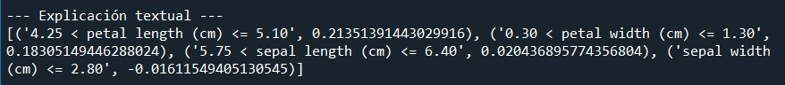
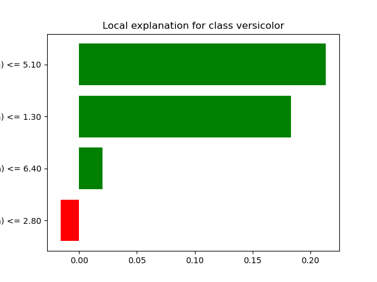

# LIME

### Desarrollo Conceptual

#### **Explicabilidad en Modelos de Inteligencia Artificial**

La explicabilidad en modelos de inteligencia artificial (IA) se refiere a la capacidad de un sistema para justificar sus predicciones o decisiones de manera comprensible para los humanos. Este concepto se ha vuelto crucial a medida que los modelos de aprendizaje automático han evolucionado hacia arquitecturas más complejas y menos interpretables, como redes neuronales profundas. La explicabilidad no solo es importante para fomentar la confianza en las decisiones automatizadas, sino también para cumplir con regulaciones legales y éticas en sectores sensibles como la salud, las finanzas y el derecho.

Una de las preguntas clave que la explicabilidad busca responder es: **"¿Por qué el modelo tomó esta decisión?"**. Esto incluye identificar las características más relevantes que contribuyeron a una predicción específica, evaluar la robustez del modelo y detectar posibles sesgos.

---

#### **Enfoques de Explicabilidad**

Existen dos enfoques principales para abordar la explicabilidad en modelos de IA:

1. **Métodos intrínsecos**:
   Los métodos intrínsecos están diseñados para que el modelo sea interpretable desde su creación. Estos modelos tienen una estructura que permite comprender directamente cómo las entradas afectan las salidas. Algunos ejemplos destacados incluyen:

- **Árboles de decisión**: La estructura jerárquica de los árboles permite rastrear cómo las decisiones se toman a través de divisiones basadas en características específicas.
- **Regresiones lineales y logísticas**: Los coeficientes de estas regresiones indican directamente la importancia de cada característica en la predicción.
- **Modelos basados en reglas**: Estos modelos se basan en reglas explícitas y claras, como "Si X > Y, entonces Z".

  **Ventajas**

-     Fácil interpretabilidad: La relación entre entradas y salidas es directa y comprensible.
-     Eficiencia computacional: Generalmente son más rápidos y menos costosos de entrenar.

  **Desventajas**

-     Menor precisión: Su capacidad para capturar relaciones complejas es limitada.
-     Escalabilidad: No se adaptan bien a datos de alta dimensión.

2. **Métodos post-hoc**:
   Los métodos post-hoc explican el comportamiento de un modelo después de haber sido entrenado, sin modificar su estructura interna. Esto los hace ideales para modelos complejos como redes neuronales, bosques aleatorios y modelos de boosting. Los métodos más comunes incluyen:

- **Visualizaciones de activaciones**: En redes neuronales, muestran qué partes de una entrada (como una imagen) activan más al modelo.
- **Métodos basados en perturbaciones**: Modifican las entradas ligeramente y analizan cómo cambian las salidas del modelo. LIME pertenece a esta categoría.
- **SHAP (SHapley Additive exPlanations)**: Basado en teoría de juegos, calcula la contribución de cada característica a la predicción.

---

#### **Introducción a LIME**

**LIME (Local Interpretable Model-Agnostic Explanations)** es un enfoque post-hoc diseñado para explicar las predicciones de modelos complejos mediante aproximaciones locales. Su principal ventaja es ser agnóstico al modelo, lo que significa que puede aplicarse a cualquier tipo de modelo, sin importar su estructura o complejidad.

El objetivo de LIME es proporcionar una explicación simple y comprensible de por qué un modelo realizó una predicción específica. Lo hace generando pequeñas perturbaciones en los datos de entrada, evaluando cómo cambia la predicción del modelo y ajustando un modelo interpretable (como una regresión lineal) a estas variaciones.

---

#### **Funcionamiento de LIME**

LIME opera bajo la premisa de que, aunque los modelos complejos sean globalmente difíciles de interpretar, pueden explicarse de forma aproximada en torno a predicciones específicas. A continuación, se amplía el flujo de trabajo de LIME:

1. **Selección de la instancia a explicar**:
   El primer paso es seleccionar una instancia específica del conjunto de datos (por ejemplo, un correo clasificado como "spam" o una imagen clasificada como "gato").

2. **Generación de perturbaciones**:
   LIME crea un conjunto de datos sintético mediante pequeñas modificaciones de la instancia seleccionada:

- Para datos tabulares: Se generan nuevas filas alterando ligeramente los valores de las características.
- Para datos de texto: Se eliminan o reemplazan palabras.
- Para imágenes: Se pixelan o eliminan regiones de la imagen.

  Estas perturbaciones simulan diferentes variaciones de la misma entrada original.

3. **Predicción de las perturbaciones**

El modelo original se utiliza para predecir las salidas de todas las perturbaciones generadas. Esto genera un conjunto de pares entrada-salida.

4. **Ajuste de un modelo interpretable**

LIME entrena un modelo simple, como una regresión lineal o un árbol de decisión, para aproximar el comportamiento del modelo original en el vecindario de la instancia analizada. Este modelo es mucho más comprensible y refleja las características más relevantes.

5. **Generación de la explicación**
   El modelo interpretable asigna un peso a cada característica de la instancia original, indicando su importancia relativa en la predicción.

6. **Visualización**
   LIME presenta la explicación en forma de gráficos o tablas, destacando las características que más influyeron en la decisión.

---

#### **Ventajas y Limitaciones de LIME**

**Ventajas:**

- **Agnosticismo al modelo**: Funciona con cualquier tipo de modelo, desde regresiones lineales hasta redes neuronales profundas.
- **Flexibilidad en datos**: Puede aplicarse a diversos tipos de datos, como texto, imágenes y tablas.
- **Explicaciones localizadas**: Permite entender el comportamiento del modelo en torno a una predicción específica, lo que es útil para identificar errores o sesgos en casos concretos.
- **Facilidad de implementación**: Su integración en proyectos existentes es sencilla, con soporte en bibliotecas populares como Python.
- **Visualización amigable**: Presenta resultados en gráficos y diagramas intuitivos que destacan las características más influyentes.

**Limitaciones:**

1. **Sensibilidad a las perturbaciones**:

   Las explicaciones dependen de cómo se generen las perturbaciones. Si estas no representan adecuadamente la distribución de los datos, los resultados pueden ser engañosos.

2. **Coste computacional**:

   Generar un conjunto grande de perturbaciones y calcular sus predicciones puede ser computacionalmente caro, especialmente con modelos complejos.

3. **Foco limitado**:

   LIME explica predicciones individuales (locales), pero no ofrece una visión global del comportamiento del modelo.

4. **Dependencia del modelo interpretable**:

   La calidad de las explicaciones depende de la capacidad del modelo simple para aproximar correctamente al modelo original en el vecindario analizado.

5. **Riesgo de interpretaciones erróneas**:

   Los usuarios pueden malinterpretar las explicaciones si no comprenden las limitaciones de LIME.

---

#### **Ejemplo Concreto**

Un ejemplo práctico de LIME es su aplicación en un modelo de clasificación de texto que predice si un correo electrónico es spam o no. Al analizar una predicción específica, LIME identifica las palabras clave en el correo que influyeron en la decisión del modelo. Por ejemplo, términos como "gratis" o "promoción" pueden aparecer como características relevantes.

Otro caso de uso es en la clasificación de imágenes. Supongamos que un modelo predice que una imagen pertenece a la clase "gato". LIME puede resaltar las regiones de la imagen (como las orejas o los ojos del gato) que fueron determinantes para la predicción, facilitando la interpretación del modelo.

### **Demo (Código): Explicabilidad con LIME**

A continuación, se describe cómo implementar una demo funcional de LIME para explicar las predicciones de un modelo de clasificación en un conjunto de datos tabular. El ejemplo utilizará un modelo de clasificación de datos y LIME para generar explicaciones interpretables.

---

#### **Objetivo**

Mostrar cómo LIME genera explicaciones interpretables para un modelo de clasificación. El modelo utilizado es un Random Forest entrenado con el dataset Iris. Se seleccionó una instancia específica del conjunto de prueba para analizar las características más relevantes en la predicción.

---

#### **Paso 1: Instalación de dependencias**

Instalar las bibliotecas necesarias antes de ejecutar el código:

```bash
pip install lime scikit-learn matplotlib pandas
```

---

#### **Paso 2: Código**

```python
# Importar bibliotecas necesarias
import pandas as pd
import numpy as np
from sklearn.model_selection import train_test_split
from sklearn.ensemble import RandomForestClassifier
from lime.lime_tabular import LimeTabularExplainer
import matplotlib.pyplot as plt

# 1. Cargar el dataset
from sklearn.datasets import load_iris
iris = load_iris()
X = pd.DataFrame(iris.data, columns=iris.feature_names)
y = iris.target

# Dividir en conjunto de entrenamiento y prueba
X_train, X_test, y_train, y_test = train_test_split(X, y, test_size=0.2, random_state=42)

# 2. Entrenar un modelo de clasificación
model = RandomForestClassifier(random_state=42, n_estimators=100)
model.fit(X_train, y_train)

# 3. Seleccionar una instancia para explicar
instance_to_explain = X_test.iloc[0].values.reshape(1, -1)

# 4. Crear el explicador LIME
explainer = LimeTabularExplainer(
    training_data=X_train.values,  # Datos de entrenamiento
    feature_names=X.columns.tolist(),  # Nombres de las características
    class_names=iris.target_names.tolist(),  # Nombres de las clases
    mode="classification"  # Modo de clasificación
)

# Generar la explicación
explanation = explainer.explain_instance(
    data_row=instance_to_explain.flatten(),  # Instancia a explicar
    predict_fn=model.predict_proba  # Función de predicción
)

# 5. Visualizar la explicación
explanation.show_in_notebook(show_table=True)
explanation.as_pyplot_figure()
plt.show()

# 6. Imprimir el resultado textual
print("\n--- Explicación textual ---")
print(explanation.as_list())
```

---

#### **Paso 3: Explicación del código**

1. **Cargar el dataset Iris**:

   - Este dataset contiene características como el largo y ancho de los pétalos de flores para clasificar especies.
   - Es un ejemplo simple para mostrar la funcionalidad de LIME.

2. **Entrenar un modelo**:

   - Se utiliza un Random Forest para la clasificación, entrenado con un 80% de los datos.

3. **Instancia a explicar**:

   - Seleccionamos una sola fila del conjunto de prueba para generar la explicación.

4. **LIMETabularExplainer**:

   - Se utiliza para explicar instancias en datos tabulares.
   - Es importante especificar los nombres de las características y las clases.

5. **Generar la explicación**:

   - Se generan perturbaciones alrededor de la instancia seleccionada.
   - LIME utiliza estas perturbaciones para crear un modelo simple que explique localmente el comportamiento del modelo.

6. **Visualización**:
   - LIME permite visualizar la importancia de las características que contribuyeron a la predicción.

---

#### **Resultados**

LIME generó la siguiente explicación para la predicción de la instancia seleccionada:



#### Interpretación:

- La característica con mayor influencia positiva fue la longitud del pétalo en el rango 4.25 a 5.10 cm (+0.2135).
- Le sigue la anchura del pétalo en el rango 0.30 a 1.30 cm (+0.1831).
- La longitud del sépalo entre 5.75 y 6.40 cm tuvo una influencia positiva menor (+0.0204).
- La anchura del sépalo menor o igual a 2.80 cm influyó negativamente (-0.0161).


