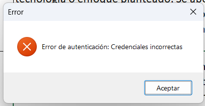

# Elva Meza

## ¿Cuál es mi experiencia en desarrollo de software?

Mi experiencia se basa más que todo en proyectos realizados en los cursos de carrera y en las practicas realizadas een mi trabajo. Acerca de los proyectos, la mayoria fueron aplicaciones o módulos web aunque también tengo experiencia un poco en aplicaciones móviles.

## ¿Qué tecnologías conozco o domino?

He trabajado con frameworks que utilizan Node.JS como Express o Nest JS utilizando tanto Javascript como Typescript. Para desarrollo front-end, conozco Next JS y React. También he trabajado con Python utilizando Open CV y Flask. Además, he utilizado algunos recursos en Azure y AWS para desplegar base de datos y aplicaciones web.

## ¿Cuál es mi expectativa del curso?

Poder comprender como diseñar una arquitectura correcta al momento de desarrollar una aplicaciones y entender cuando y porque utilizar las diversas tecnologías que tenemos disponible para desarrollar.

## ¿Cómo me veo en 10 años?

Trabajando como desarrollador de software junto a un equipo de desarrollo y enseñando temas relacionados a la ingeniería de software.

# Desarrollo Seguro de Aplicaciones

El desarrollo seguro de aplicaciones es un enfoque integral que busca minimizar los riesgos de seguridad a lo largo de todo el ciclo de vida del software. Este proceso abarca desde la fase de concepción hasta el despliegue y mantenimiento, asegurando que las vulnerabilidades potenciales sean identificadas y mitigadas antes de que se conviertan en amenazas reales. Es esencial no solo para proteger los datos de los usuarios, sino también para garantizar la integridad y disponibilidad del sistema.

## Conceptos Clave

### Seguridad desde el Diseño ("Security by Design")

La seguridad desde el diseño es un principio que implica integrar medidas de seguridad desde las primeras fases del desarrollo de software. Este enfoque asegura que los riesgos potenciales sean considerados y abordados antes de que el código sea implementado. Security by Design se centra en la identificación de amenazas, el diseño de arquitecturas seguras y la aplicación de patrones de seguridad, lo que reduce la posibilidad de vulnerabilidades en el producto final.

Por ejemplo, uno de los patrones de seguridad comúnmente aplicados es la validación de entradas, donde se verifica que todos los datos ingresados por los usuarios cumplan con los formatos esperados antes de procesarse. Otro ejemplo es el principio de privilegio mínimo, donde cada componente o usuario del sistema solo tiene los permisos estrictamente necesarios para cumplir sus funciones.

### Ciclo de Vida de Desarrollo Seguro (SDLC)

El Ciclo de Vida de Desarrollo Seguro (Secure Development Lifecycle o SDLC) proporciona un enfoque sistemático para garantizar que la seguridad sea una prioridad en cada etapa del desarrollo, minimizando el riesgo de que vulnerabilidades lleguen al producto final. Estas fases incluyen:

1. **Planificación y Análisis de Requisitos**: En esta fase se identifican los requisitos de seguridad del sistema, asegurándose de que los riesgos potenciales sean considerados desde el principio.

2. **Diseño**: Durante el diseño, se incorporan patrones y arquitecturas de seguridad. Esto incluye la aplicación de principios como el mínimo privilegio y la defensa en profundidad.

3. **Implementación**: En esta fase se desarrollan las funcionalidades, siguiendo buenas prácticas de codificación segura, como la validación de entradas, el manejo adecuado de errores y el cifrado de datos sensibles.

4. **Pruebas**: Las pruebas de seguridad son fundamentales para identificar vulnerabilidades antes del despliegue. Incluyen pruebas de penetración, revisión de código y análisis de vulnerabilidades.

5. **Despliegue**: Asegurar que el entorno de producción esté configurado correctamente y que se apliquen las mejores prácticas de seguridad.

6. **Mantenimiento**: En esta etapa se monitorea la aplicación para detectar y corregir nuevas vulnerabilidades que puedan surgir, asegurando la continuidad de la seguridad a lo largo del tiempo.

El SDLC proporciona un enfoque sistemático para garantizar que la seguridad sea una prioridad en cada etapa del desarrollo, minimizando el riesgo de que vulnerabilidades lleguen al producto final.

### OWASP (Open Web Application Security Project)

OWASP proporciona recursos, herramientas y buenas prácticas que ayudan a los desarrolladores a crear aplicaciones más seguras. Su iniciativa más conocida, el OWASP Top 10, detalla las vulnerabilidades más comunes y críticas que deben ser abordadas durante el desarrollo, sirviendo como una guía fundamental para asegurar que las aplicaciones estén protegidas contra amenazas conocidas. Entre las herramientas que OWASP ofrece se encuentran OWASP ZAP para pruebas de penetración automatizadas y Dependency-Check para detectar vulnerabilidades en bibliotecas de terceros.

### Gestión de Vulnerabilidades

La gestión de vulnerabilidades es un proceso esencial en el desarrollo seguro de aplicaciones. Consiste en la identificación, evaluación y mitigación de vulnerabilidades que puedan afectar la seguridad del sistema. Este proceso incluye:

- **Identificación de Vulnerabilidades**: Utilizando herramientas automatizadas, como escáneres de código y pruebas de penetración, los desarrolladores pueden identificar problemas de seguridad en el código fuente.

- **Evaluación del Riesgo**: No todas las vulnerabilidades tienen el mismo impacto, por lo que es crucial evaluar el nivel de riesgo de cada una para determinar cuáles deben ser atendidas con mayor urgencia.

- **Mitigación y Corrección**: Una vez identificadas y evaluadas, las vulnerabilidades deben ser corregidas mediante parches o mejoras en el código. Es importante también que se realicen nuevas pruebas para asegurar que las correcciones no hayan introducido nuevos problemas.

- **Monitoreo Continuo**: La gestión de vulnerabilidades no termina con la corrección. Es necesario realizar un monitoreo continuo para detectar posibles nuevas amenazas que surjan a medida que cambian los entornos y se actualizan las tecnologías.

## Ejemplos practicos

### Inyeccion de SQL:

La siguiente es una demostración de cómo una inyección de SQL puede ser probada para verificar la existencia de vulnerabilidades en OWASP Juice Shop, una aplicación web intencionadamente insegura utilizada para prácticas de seguridad. El código intenta autenticar al usuario utilizando datos maliciosos, y el resultado fue 'credenciales incorrectas', lo cual indica que el sistema rechazó la inyección:

    Sub ProbarAutenticacionJuiceShop()
    ' Paso 1: Crear el objeto HTTP para realizar la solicitud
    Dim http As Object
    Set http = CreateObject("MSXML2.ServerXMLHTTP")

    ' Paso 2: Definir la URL a la cual se realizará la autenticación
    Dim url As String
    url = "http://localhost:3000/rest/user/login" ' URL del endpoint de autenticación de Juice Shop

    ' Paso 3: Definir los parámetros que se enviarán en la solicitud (datos maliciosos)
    Dim parametros As String
    parametros = "email=' OR '1'='1&password=cualquiercosa"

    ' Paso 4: Configurar la solicitud HTTP
    http.Open "POST", url, False
    http.setRequestHeader "Content-Type", "application/x-www-form-urlencoded"

    ' Paso 5: Enviar la solicitud HTTP con los parámetros definidos
    http.Send parametros

    ' Paso 6: Verificar la respuesta de la solicitud
    If http.Status = 200 Then
        MsgBox "Posible vulnerabilidad encontrada: " & http.responseText, vbInformation, "Resultado de la Prueba"
    ElseIf http.Status = 401 Then
        MsgBox "Error de autenticación: Credenciales incorrectas", vbCritical, "Error"
    Else
        MsgBox "Error en la solicitud: " & http.Status, vbCritical, "Error"
    End If
    End Sub

## Link Drive

https://drive.google.com/file/d/1sT0VTZ9vy_mH062nRhdpFpBf1lUVWdc-/view?usp=sharing
