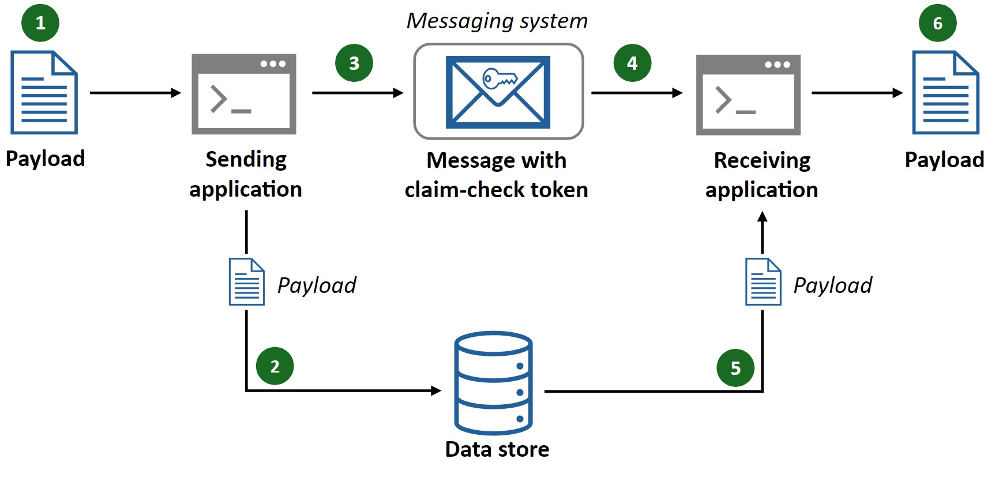

# Trabajo de implementacion de Patrones Cloud

1. **Tema**: Claim-Check

2. **Desarrollo de Patron**

## Problema:
El patrón Claim-Check busca podeer transferir grandes volúmenes de datos entre componentes de manera eficiente. En arquitecturas distribuidas o sistemas de integración, cuando se manejan datos pesados (imágenes, archivos grandes, o grandes conjuntos de información), la transferencia directa de esos datos puede causar sobrecarga de la red, aumentar los tiempos de respuesta, consumir muchos recursos y algunas veces no se necesita el todos los datos.

## Solución:

Propone una solución de almacenamiento de los datos pesados en un repositorio centralizado. En lugar de transferir los datos directamente, se envía un identificador único (Claim-Check) que representa esos datos. Este identificador permite a los sistemas destinatarios recuperar los datos cuando los necesiten, minimizando así el tráfico de red y la sobrecarga de recursos.

## Casos de Aplicación:

Por ejemplo, en los sistemas bancarios y financieros los informes o documentos financieros pesados se generan y almacenan en sistemas externos. Por ello los sistemas internos solo intercambian identificadores para recuperar estos informes cuando sea necesario, mejorando la eficiencia.

#### Envio de estado de cuenta

1. Se realiza el envio del estado de cuenta
2. Se almacena el estado de cuenta en el sistema externo
3. Se manda un identidicador con la ubicacion del estado de cuenta en el sistema externo
4. Recibe y lee el identificador del estado de cuenta
5. Obtiene el estado de cuenta con el identificador en el sistema externo
6. Brinda el estado de cuenta al sistema solicitado

  

## Aplicación en el trabajo grupal:

#### Modulo de Mensajeria

1. Se realiza el envio del video del usuario A al usuario B
2. Se almacena el envio del video en la base de datos
3. Se manda un identidicador con la ubicacion del envio del video en la base de datos al usuario B
4. Recibe y lee el identificador del envio del video el usuario B
5. El usuario B busca el video con la base de datos
6. El ususario B desacrga el video y lo puede reproducir