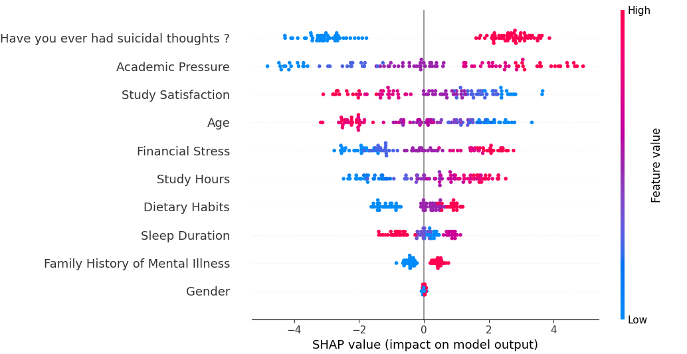

# Explicabilidad de modelos de Machine Learning con enfoque en SHAP

## Definición: ¿Qué es explicabilidad en Machine Learning?

La explicabilidad en Machine Learning es la capacidad de entender el raciocinio detrás de las decisiones de un modelo. 
En un contexto de modelos complejos como redes neuronales, bosques aleatorios o XGBoost, los 
resultados suelen ser interpretados como "cajas negras", dificultando comprender cómo las variables influyen en 
las salidas. La explicabilidad busca ofrecer claridad sobre estos procesos, garantizando confianza, cumplimiento normativo 
y toma de decisiones informadas.

## ¿Qué es y cómo funciona SHAP?

SHAP es un método basado en la teoría de juegos que explica las predicciones de un modelo evaluando la contribución 
de cada característica a la predicción. Inspirado en los valores de Shapley, SHAP asigna a cada característica un "valor de importancia" 
que mide su impacto en la predicción de un modelo.

### ¿Cómo funciona?

1. **Modelo Base:** SHAP utiliza un modelo de referencia para comparar las predicciones realizadas cuando se incluyen ciertas 
características contra cuando no están presentes.

2. **Contribuciones Individuales:** Calcula el impacto marginal de cada característica probando combinaciones posibles.

3. **Suma Aditiva:** Los valores SHAP se suman para igualar la predicción del modelo, garantizando una distribución equitativa de las influencias.

El resultado es un desglose intuitivo y matemáticamente sólido de las predicciones.

## SHAP en diferentes tipos de modelos

SHAP puede aplicarse a múltiples tipos de modelos de Machine Learning:

- **Modelos Lineales:** Explica la importancia de características directamente, alineándose con los coeficientes del modelo.
- **Modelos de Árboles:** Calcula el impacto de cada característica con precisión en algoritmos no lineales, identificando interacciones y jerarquías.
- **Redes Neuronales:** Utiliza técnicas como Deep SHAP, que combina SHAP con aproximaciones basadas en redes neuronales.

## Comparación de explicabilidad local y global

- **Explicabilidad Local:** SHAP permite entender cómo las características específicas de una observación individual contribuyen a su predicción.
- **Explicabilidad Global:** Con SHAP, se pueden resumir las contribuciones promedio de las características en todas las observaciones, proporcionando una visión general del comportamiento del modelo.

## ¿Cómo interpretar SHAP?

1. **Gráfico de fuerza:** Muestra cómo las características influyen en una predicción específica. Características positivas (rojo) empujan la predicción hacia arriba, mientras que las negativas (azul) la reducen.
2. **Gráfico de resumen:** Representa los valores SHAP de todas las observaciones, permitiendo identificar patrones generales en la importancia de las características.
3. **Gráfico de dependencia:** Relaciona una característica con su valor SHAP, mostrando cómo impacta la predicción y revelando interacciones con otras variables.

## Ventajas de SHAP

- **Interpretación precisa:** Ofrece valores equitativos basados en la teoría de juegos.
- **Aplicable a múltiples modelos:** Funciona con modelos lineales y no lineales.
- **Desglose visual claro:** Los gráficos de SHAP son intuitivos y útiles para comunicar resultados a audiencias no técnicas.

## Desventajas de SHAP

- **Costo computacional:** El cálculo de valores SHAP es intensivo, especialmente para modelos complejos y grandes conjuntos de datos.
- **Complejidad técnica:** Requiere conocimientos avanzados para configurar e interpretar adecuadamente.
- **Asumir independencia:** Algunas aproximaciones como Kernel SHAP pueden dar resultados imprecisos si las características están altamente correlacionadas.

## Ejemplos de uso

En este proyecto, se utilizó un dataset sobre estudiantes para predecir la probabilidad de depresión, considerando factores como género, hábitos alimenticios, duración del sueño y presión académica. Se aplicaron técnicas de preprocesamiento, como codificación de variables categóricas y normalización, para preparar los datos. Luego, se entrenaron los modelos XGBoost y SVM, cuyos desempeños fueron evaluados mediante métricas como precisión, matrices de confusión y el F1-score.

Los resultados obtenidos muestran que el modelo SVM supera al XGBoost en términos de desempeño general, destacándose con un F1-score de 0.98, frente al 0.96 obtenido por XGBoost. Este resultado también se refleja en la matriz de confusión, donde el SVM logra una mejor proporción de predicciones correctas en ambas clases.

Para interpretar los resultados, se empleó la herramienta SHAP, que permitió analizar la contribución de cada característica a las predicciones, tanto a nivel global como local.

### Shap Global

#### XGBoost

#### SVM

Los resultados de SHAP para ambos modelos resaltan que la variable más importante es si el estudiante ya ha tenido pensamientos suicidas. Le sigue la presión académica como un factor determinante. En el tercer lugar, existe una disputa entre la satisfacción académica y el estrés financiero, dependiendo del modelo. Esto evidencia que la mayoría del peso recae en factores académicos, mientras que aspectos demográficos tienen un impacto menor pero relevante.

En el caso de la satisfacción académica, su contribución varía según los valores individuales de los estudiantes. Los estudiantes con bajos niveles de satisfacción (Puntos azules) tienden a contribuir positivamente a la predicción de mayores probabilidades de depresión (Se encuentra al lado derecho del eje X).

### Shap Local

#### Satisfaccion Academica

En este caso se utilizao explicabilidad local de la variable de "Satisfaccion Academica" para ver como influye en el modelo. segun los graficos solo es relevante cuando el valor es muy bajo o muy alto, debido a que en valores medios baja su importanca hasta el septimo lugar

#### Fuentes:
- https://www.kaggle.com/datasets/hopesb/student-depression-dataset
- https://docs.google.com/document/d/1Py5gog-leLkhMtiRjUS4SG1iuZGz1EX-/edit?usp=sharing&ouid=100176324950979962238&rtpof=true&sd=true 

#### Video:
- https://drive.google.com/file/d/1C82VTF0q-DRPhK5oaFEouJvJzEXctaGc/view?usp=sharing