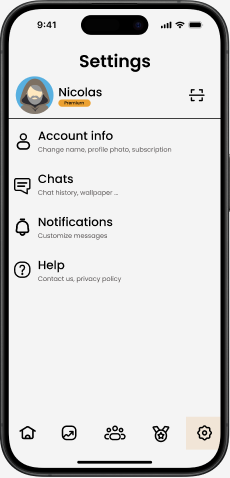
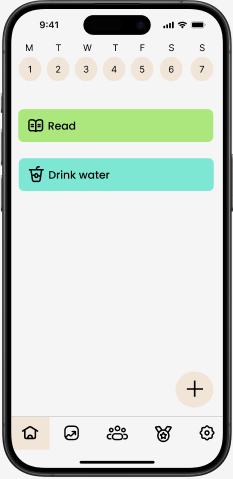
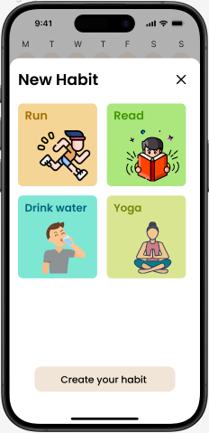
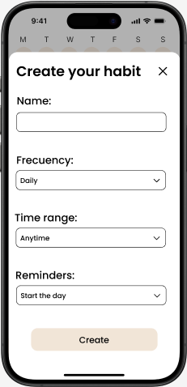
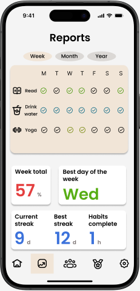
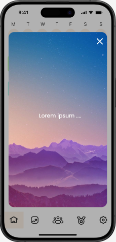
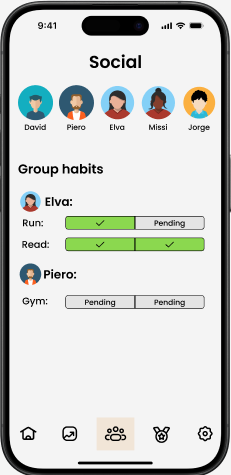
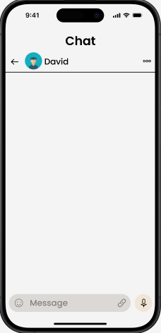

# 2.1. Requerimientos Funcionales

### Módulo de *Usuarios*
1. *Registro de usuarios*: Permitir a los nuevos usuarios crear una cuenta con su correo electrónico.
2. *Iniciar sesion*: Realizar el inicio de sesión seguro utilizando usuario y contraseña.
4. *Gestión de perfiles*: Permitir a los usuarios editar su información personal, como nombre, foto de perfil, y preferencias.
5. *Cerrar cuenta*: Permitir a los usuarios cerrar su cuenta cuando ya no desean usar la aplicación.
6. *Logueo rápido con cuentas de redes sociales*: El usuario puede acceder a la aplicación de forma sencilla y rápida mediante su red social favorita

  
Configuracion

  

### Módulo de *Hábitos*
1. *Creación de hábitos*: Permitir a los usuarios crear nuevos hábitos individuales o mutuos, especificando detalles como nombre, frecuencia y meta.
2. *Edición de hábitos*: Permitir modificar hábitos existentes.
3. *Eliminación de hábitos*: Posibilitar la eliminación de hábitos que ya no se deseen.
4. *Registro de hábitos completados*: Permitir a los usuarios marcar como completados los hábitos del dia.
5. *Mostrar los habitos*: Los usuarios deben ser capaces de ver todos sus habitos.
6. *Mostrar los habitos de hoy*: Los usuarios deben ser capaces de ver sus habitos del dia pendientes
7. *Mostrar los habito mutuos*: Ofrecer la posibilidad de ver los habitos mutuos junto con el progreso de todos sus integrantes.

  
Módulo de hábitos

  

  
Agregar hábito

  

  
Creacion de hábitos

  

### Módulo de *Analisis*
1. *Visualización del progreso*: Mostrar un resumen del progreso de los hábitos con gráficos de rendimiento.
2. *Recomendación de nuevos hábitos personalizados*: Recomendar hábitos seguidos de acuerdo a las metas en común de diferentes usuarios
4. *Generacion de mensajes motivacionales*: En base al progreso de los habitos generar mensajes motivacionale spara el usuario
5. *Recomendación de amigos en base a hábitos*: En base al historial de habitos se recomiendan a los usuarios con habitos similares.

  
Reportes

  

### Módulo de *Notificaciones*
1. *Mostrar mensajes motivacionales*: Mostrar pantallas o secciones con mensajes motivacionales para mantener el ánimo alto.
2. *Mostrar recordatorios*: Enviar a los usuarios recordatorios de sus habitos diarios pendientes.
3. *Mostrar notificaciones motivacionales*: Mostrar a los usuarios notificaciones motivacionales.
4. *Mostrar racha*: Mostrar una racha con la cantidad de dias consecutivos con habitos completados.
5. *Configurar notificaciones*: Permitir a los usuarios configurar notificaciones según deseen.
6. *Controlador de Publicidad*: Gestiona cuándo y dónde se muestran los anuncios según las acciones del usuario.

  
Mensaje motivacional

  

### Módulo de *Amigos*
1. *Búsqueda de amigos*: Permitir a los usuarios buscar otras personas según su nombre de usuario.
2. *Conexión con amigos*: Permitir a los usuarios agregar a otros usuarios como amigo.
3. *Ver perfil de amigos*: Permitir a un usuarios ver el perfil de un amigo con su información de usurio y de habitos.
4. *Invitar a un habito mutuo*: Permitir enviar invitaciones a sus amigos para que se unan a un habito mutuo
5. *Unirse a un habito mutuo*: Permitir a un usuario aceptar la invitación a un habito mutuo y unirse.
5. *Salir de un habito mutuo*: Permitir a un usuario abandonar un habito mutuo.

  
Amigos

  

### Módulo de *Mensajeria*
1. *Crear chat con amigo*: Iniciar un chat de comunicación directa en tiempo real entre amigos.
2. *Enviar mensaje*: Permite al usuario enviar un mensaje dentro de un chat.
3. *Enviar contenido multimedia*: Permite al usuario enviar fotos o videos dentro de un chat.
4. *Mostrar notificaciones de mensajes*: Enviar notificaciones a los usuarios cuando reciban mensajes en algun chat.
5. *Creacion de chat grupal*: Para cada habito mutuo, se crea automaticamente un chat grupal que contenga los integrantes del habito mutuo.

  
Chat

  

