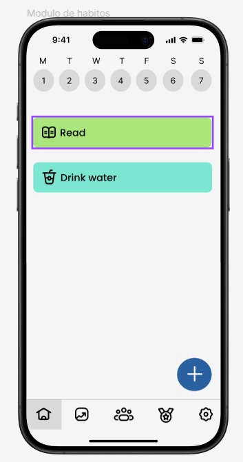
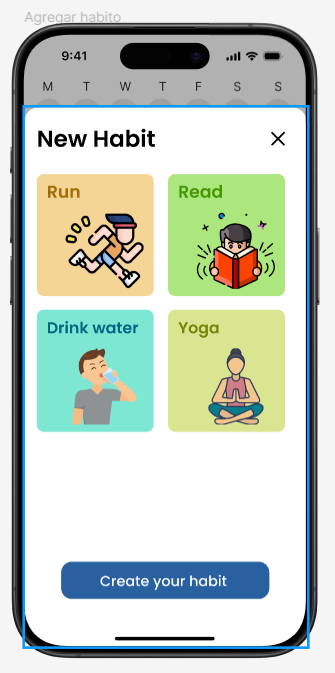
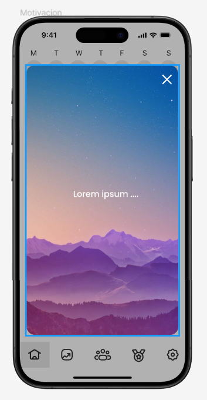
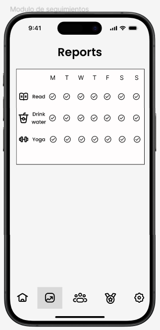
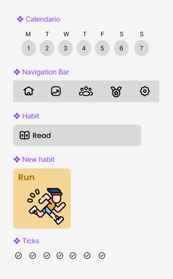

# 2.2. Requerimientos de Atributos de Calidad (Escenarios)

## Usuarios

| **Atributo de Calidad** | **Fuente del Estímulo**          | **Estímulo**                                    | **Artefacto**                 | **Entorno**                           | **Respuesta**                                                                            | **Medida de Respuesta**                                                                                    |
| ----------------------- | -------------------------------- | ----------------------------------------------- | ----------------------------- | ------------------------------------- | ---------------------------------------------------------------------------------------- | ---------------------------------------------------------------------------------------------------------- |
| Disponibilidad      | Servidor de autenticacion        | Fallo en el servidor de autenticacion           | Módulo de Gestión de Usuarios | Operación normal                      | El sistema debe redirigir al usuario a un servidor de respaldo                           | El sistema está disponible el 99.99% del tiempo al año                                                     |
| Rendimiento         | Usuarios activos                 | Acceso concurrente de 1000 usuarios             | Módulo de Gestión de Usuarios | Alta demanda                          | El sistema debe gestionar el acceso simultáneo sin retraso ni caídas                     | El tiempo de respuesta para ver autenticarse o ver el perfil no supera los 3 segundos                      |
| Seguridad         | Usuario no autenticado           | Intento de acceso no autorizado                 | Módulo de Gestión de Usuarios | Operación normal                      | El sistema debe denegar el acceso y registrar el intento                                 | El porcentaje de intentos de acceso no autorizados denegados debe ser del 100%                             |
| Escalabilidad       | Crecimiento de usuarios          | Incremento en el número de usuarios registrados | Módulo de Gestión de Usuarios | Alto crecimiento                      | El sistema debe manejar el aumento en la base de usuarios sin bajar su rendimiento       | El sistema debe soportar un aumento del 50% sobre los usuarios esperados sin necesidad de reestructuración |
| Usabilidad          | Nuevos usuarios                  | Interacción de autenticacion                    | Módulo de Gestión de Usuarios | Diferentes dispositivos y navegadores | La interfaz debe ser estandar en la interfaz de autenticacion para que sea fácil de usar | Cero quejas por incapacidad de navegar por la interfaz de autenticacion                                    |

## Habitos (Nicolas)

| Atributo de Calidad | Estímulo | Fuente del Estímulo | Artefacto | Entorno | Respuesta | Medida de Respuesta |
|---------------------|----------------------------------------------------------|-----------------------|---------------------------------|---------------------------------------|------------------------------------------------------------------|------------------------------------------------------------------------|
| Disponibilidad | Fallo en la conexión a la base de datos | Servidor de la nube | Módulo de Hábitos | Operación normal durante el uso de la aplicación | El sistema sigue funcionando, los datos se sincronizan cuando vuelve la conexión | El sistema puede operar offline durante 10 minutos sin pérdida de datos |
| Disponibilidad | Actualización del sistema | Equipo de desarrollo | Módulo de Hábitos | Fuera del horario laboral | El sistema entra en modo de mantenimiento programado | El tiempo de inactividad no supera los 15 minutos |
| Rendimiento | Consulta de hábitos históricos del usuario | Usuario | Módulo de Hábitos | Operación normal | El sistema debe devolver los resultados rápidamente | El tiempo de respuesta no excede los 3 segundos para hasta 500 hábitos |
| Seguridad | Intento de modificación de hábitos por un usuario no autenticado | Usuario no autenticado | Módulo de Hábitos | Intento de acceso al sistema sin autenticación | El sistema rechaza la solicitud y registra el evento | El sistema rechaza el 100% de los intentos no autenticados |
| Usabilidad | Interacción de un usuario nuevo con la pantalla de hábitos | Usuario nuevo | Módulo de Hábitos | Primera vez utilizando el sistema | El usuario debe poder entender cómo realizar las operaciones sin asistencia | El usuario completa la operación deseada en menos de 2 minutos sin pedir ayuda |

## Seguimiento

| **Atributo de Calidad** | **Fuente del Estímulo** | **Estímulo** | **Artefacto** | **Entorno** | **Respuesta** | **Medida de Respuesta** |
|-------------------------|-------------------------|--------------------------------------------------|-------------------------|-------------------------|-------------------------------------------------------------------------|---------------------------------------------------------------|
| **Disponibilidad**      | Servidor de la nube      | Fallo en la conexión a la base de datos           | Módulo de Seguimiento    | Operación normal         | El sistema guarda los datos localmente y los sincroniza cuando vuelve la conexión | El sistema puede operar offline hasta 15 minutos sin pérdida de datos |
| **Rendimiento**         | Usuario                 | Solicitar reporte de hábitos         | Módulo de Seguimiento    | Operación normal         | El sistema debe generar y mostrar el reporte en tiempo razonable              | El tiempo en generar las graficas y estadisticas de los habitos no debe superar los 2 segundos para reportes con hasta 1000 entradas |
| **Usabilidad**          | Usuario                 | Usuario desea revisar su progreso    | Módulo de Seguimiento    | Operación normal         | La interfaz debe ser clara con graficos y estadísticas útiles y fáciles de entender  | El 95% de los usuarios afirma poder interpretar correctamente los gráficos y estadísticas de forma rápida |
| **Escalabilidad**       | Incremento de hábitos    | Incremento en la cantidad de datos de seguimiento | Módulo de Seguimiento    | Crecimiento continuo     | El sistema debe manejar el aumento de datos sin disminuir su rendimiento        | El sistema debe poder gestionar hasta 10,000 entradas de hábitos sin ralentizaciones en el seguimiento y reporte |

## Motivacion

| Atributo de Calidad | Estímulo | Fuente del Estímulo | Artefacto | Entorno | Respuesta | Medida de Respuesta |
|----------------------|----------------------------------------------------------|-----------------------|---------------------------------|---------------------------------------|------------------------------------------------------------------|------------------------------------------------------------------------|
| Disponibilidad | Fallo en la conexión a Internet | Usuario | Servicio de Mensajes Motivacionales | Operación con conexión intermitente | El sistema almacena los mensajes y los envía cuando se restablezca la conexión | El sistema asegura la entrega del 100% de los mensajes dentro de los primeros 30 segundos tras la reconexión |
| Disponibilidad | Actualización del sistema | Equipo de desarrollo | Módulo de Mensajes Motivacionales | Fuera del horario laboral | El sistema entra en modo de mantenimiento programado | El tiempo de inactividad debe ser menor a 99.99% de uptime al mes |
| Rendimiento | Envío de notificaciones simultáneas | Usuarios suscritos | Servicio de Notificaciones | Alta demanda durante el día | El sistema procesa y envía las notificaciones sin retraso significativo | El tiempo de respuesta no supera los 2 segundos por notificación |
| Rendimiento | Visualización de mensajes motivacionales | Usuario | Pantalla de Mensajes Motivacionales | Operación normal | Los mensajes deben cargarse rápidamente | El tiempo de carga no debe superar 1 segundo al acceder |
| Seguridad | Intento de acceso no autorizado | Usuario no autorizado | Servicio de Notificaciones Personalizadas | Operación normal | El sistema bloquea el acceso y solicita autenticación adicional | El 100% de los accesos no autorizados deben ser bloqueados |
| Usabilidad | Necesidad de lectura rápida de mensajes | Usuario | Pantalla de Mensajes Motivacionales | Operación normal | Los mensajes se muestran de manera clara y concisa | El 95% de los usuarios deben poder leer el mensaje en menos de 5 segundos |

## Amigos

| Atributo de Calidad | Estímulo | Fuente del Estímulo | Artefacto | Entorno | Respuesta | Medida de Respuesta |
|----------------------|------------------------------------------------------|-----------------------|---------------------------|-----------------------|------------------------------------------------------------|-----------------------------------------------------------|
| Disponibilidad | Fallo en la sincronización de datos con el servidor | Servidor en la nube | Módulo de Gestión de Amigos | Operación normal | El sistema reintenta la sincronización al recuperar conexión | Los datos se sincronizan en menos de 10 segundos |
| Rendimiento | Solicitud de amistad simultáneas | Multiples Usuarios | Módulo de Gestión de Amigos | Alta demanda | El sistema procesa las solicitudes sin retraso | El tiempo de respuesta no supera los 2 segundos |
| Usabilidad | Navegación para añadir o eliminar amigos | Usuarios | Módulo de Gestión de Amigos | Operación normal | El sistema ofrece una interfaz simple | La acción de añadir/eliminar amigos no excede los 2 toques |
| Escalabilidad | Crecimiento en la base de usuarios simultáneos | Expansión de usuarios | Módulo de Gestión de Amigos | Crecimiento continuo | El sistema adapta su infraestructura para manejar más usuarios | Puede gestionar hasta 10,000 usuarios simultáneos |

## Mensajeria

| **Atributo de Calidad** | **Estímulo** | **Fuente del Estímulo** | **Artefacto** | **Entorno** | **Respuesta** | **Medida de Respuesta** |
|-------------------------|------------------------------------------------|-------------------------|--------------------|-------------------------|-------------------------------------------------------------------------------|---------------------------------------------------------------|
| **Disponibilidad** | Fallo en el servidor de chat | Servidor de la nube | Módulo de Chat | Operación normal | El sistema pasa automáticamente a un servidor de respaldo | El sistema está disponible el 99.99% del tiempo al año |
| **Rendimiento** | Envío de mensajes simultáneos por 1000 usuarios | Usuarios | Módulo de Chat | Alta demanda | El sistema debe procesar los mensajes en tiempo real sin retraso significativo | El tiempo de respuesta no supera los 2 segundos |
| **Rendimiento** | Consulta de historial de mensajes | Usuario o administrador | Módulo de Chat | Operación normal | El sistema debe devolver los mensajes históricos en un tiempo razonable | El tiempo de respuesta no excede los 3 segundos para un millón de mensajes |
| **Seguridad**           | Atacante externo         | Intento de interceptar mensajes                  | Módulo de Chat                | Comunicación entre usuarios | El sistema debe cifrar los mensajes usando cifrado de extremo a extremo para evitar la interceptación | Todos los mensajes deben ser cifrados con AES-256 y ningún mensaje debe ser accesible para terceros |
| **Usabilidad** | Usuario intenta enviar un mensaje | Usuario | Interfaz del Chat | Operación normal | El sistema debe permitir el envío intuitivo de mensajes sin necesidad de ayuda | El 95% de los usuarios puede enviar mensajes sin capacitación |

**Prototipo**

  
Módulo de hábitos

  

  
Agregar hábito

  

  
Motivación

  

  
Módulo de seguimiento

  

  
Página principal

  

