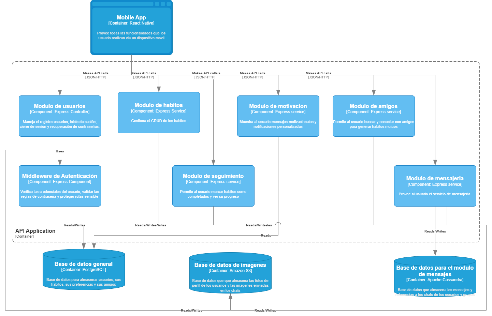
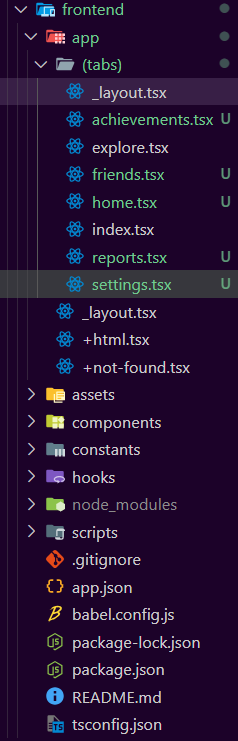
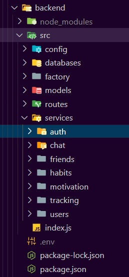

# 6.2. Mapeo Aplicaciones vs Componentes

La implementacion de los elementos de la aplicación ha ido de la mano con los diagramas elaborados anteriormente. 

Como se observa, en primer lugar está la aplicación movil, la cual ha sido iniciada con React Native y se han creado las pantallas iniciales que va a tener la aplicación junto con los demás archivos que pertenecen al framework.

Por la parte del backend, se ha creado el proyecto de Nodejs con Express y se han creado las carpetas donde irán los modulos correspondientes, los cuales son:

- auth: Middleware de autenticación
- chat: Modulo de mensajeria
- friends: Modulo de amigos
- habits: Modulo de habitos
- motivation: Modulo de motivacion
- tracking: Modulo de seguimiento
- users: Modulo de usuarios

