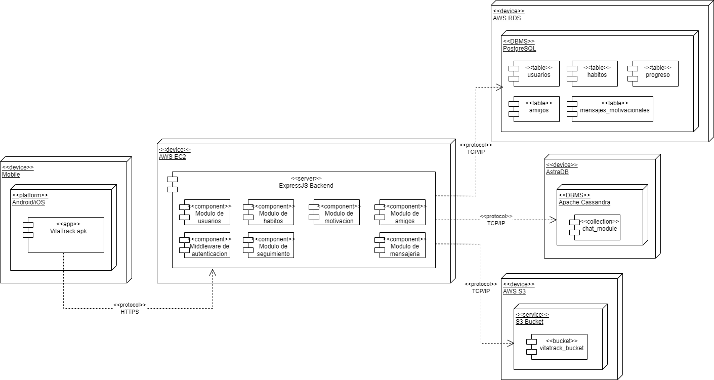
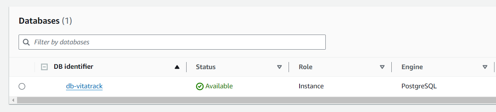
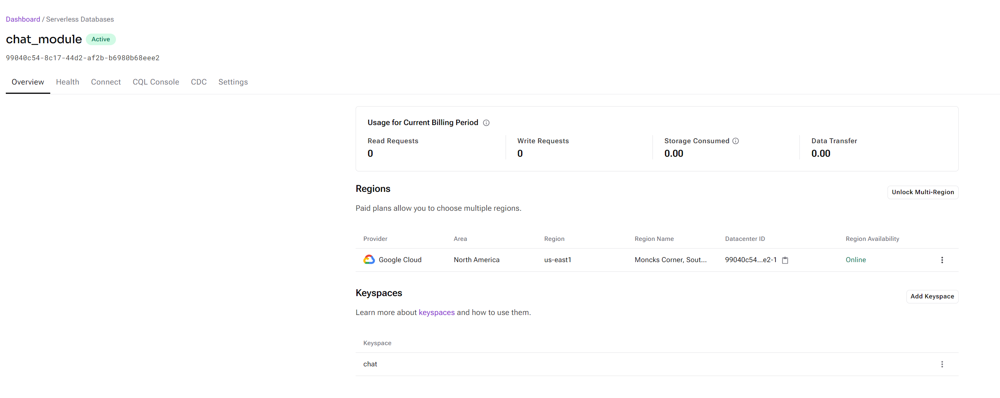

# 6.2. Mapeo Aplicaciones vs Componentes

La implementacion de los elementos de la aplicación ha ido de la mano con los diagramas elaborados anteriormente tanto del diagrama de Componentes C4 como el diagrama de despliegue UML. 

Como se observa, en primer lugar está la aplicación movil, la cual ha sido desarrollada con React Native y se han creado las pantallas iniciales que va a tener la aplicación junto con los demás archivos que pertenecen al framework.

Por la parte del backend, se ha creado el proyecto de Nodejs con Express y se han creado las carpetas donde irán los modulos correspondientes, los cuales son:

- auth: Middleware de autenticación
- chat: Modulo de mensajeria
- friends: Modulo de amigos
- habits: Modulo de habitos
- motivation: Modulo de motivacion
- tracking: Modulo de seguimiento
- users: Modulo de usuarios

Por la parte de las bases de datos utilizadas, se han creado las instancias para las tres bases de datos:

- PostgreSQL: En AWS RDS, se ha creado la base de datos Postgres de la aplicación Vitatrack y adentro de la instancia se encuentran sus tablas correspondientes para almacenar los datos de toda la apliación en general.
  
  
  
- Apache Cassandra: Utilizando el servicio de AstraDB, se ha creado la instancia de Cassandra la cual será usada para el modulo de mensajeria.

  

- S3 Bucket: En AWS S3, se ha creado el Bucket vitatrack-bucket en el que se almacenarán las imagenes tanto de perfil como de los chats.

  
