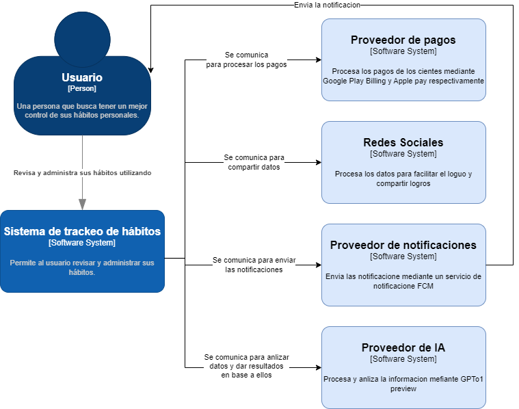
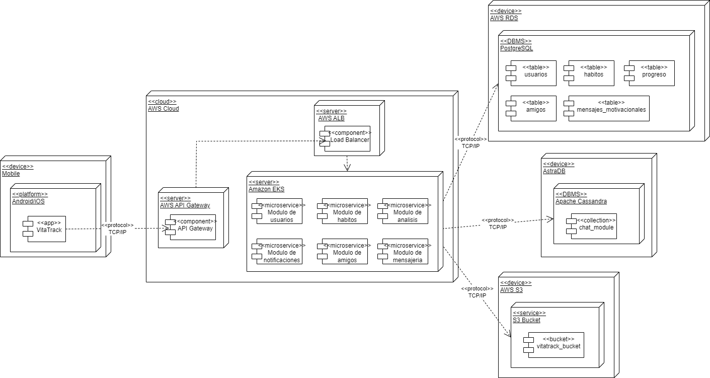

# 9.2. Iteración 1: Definir la estructura general del sistema

## Paso 1: Revisar Entradas
| **Propósito de Diseño**     | **Funcionalidad Primaria**     | **Escenarios de Calidad**       | **Restricciones y Preocupaciones de Arquitectura**      |
|-----------------------------|--------------------------------|--------------------------------|--------------------------------------------------------|
| Definir un sistema desde cero empezando con la arquitectura base que permita gestionar usuarios, servicios para traquear hábitos personales y comunicación entre los usuarios en la plataforma de manera escalable, rápida y segura. | - Implementar el registro e inicio de sesión (UC-01, UC-02).  - Creación y visualización de hábitos (UC-06, UC-10).  - Visualizar el progreso de los hábitos cumplidos (UC-13).  - Mostrar recordatorios via notificaciones (UC-18) | - El sistema debe permitir el acceso solo a los usuarios autorizados (QA-02).  - La app debe responder de forma rápida (QA-07).  - El sistema debe permitir un crecimiento de cantidad usuarios sin perder rendimiento (QA-05). | - Uso de React Native y Express JS como tecnologías principales para frontend y backend respectivamente (CON-01).  - Uso de base de datos PostgresSQL, MongoDB en la nube (CON-03).  - Escalabilidad para soportar futuros aumentos en la carga de usuarios (CON-05). |

## Paso 2: Establecer el objetivo de la iteración.
Al ser la primera iteración nuestra preocupación más importante es definir una estructura base de la arquitectura para desarrollar la aplicación, ya que esta se está realizando desde cero.

## Paso 3: Elegir uno o más elementos a refinar.
No se realiza refinamiento debido a que recién se esta empezando con el diseño del sistema.

## Paso 4: Elegir uno o más conceptos de diseño que satisfacen el driver seleccionado
| **Código** | **Decisión de Diseño**                                      | **Fundamentación**                                                                                      |
|------------|-------------------------------------------------------------|--------------------------------------------------------------------------------------------------------|
| DEC-1      | Utilizar una arquitectura de descomposición por dominio. | Esta arquitectura separa cada servicio del sistema en dominios especificos mejorando la escalabilidad (CON-05). |
| DEC-2      | Usar React Native para el frontend y Express JS para los microservicios | Aprovecha los conocimiento del equipo facilitando el desarrollo (CON-01). |
| DEC-3      | Utilizar PostgresSQL para el almacenamiento de la información de los usuarios. | PostgresSQL es altamente escalable y seguro, además de ser conocido por el equipo (CON-05, CON-03). |

## Paso 5: Instanciar elementos de la arquitectura, asignar responsabilidades y definir interfaces.
| **Código** | **Decisión de Diseño**                                      | **Fundamentación**                                                                                      |
|------------|-------------------------------------------------------------|--------------------------------------------------------------------------------------------------------|
| DEC-4      | Crear módulos de usuarios, hábitos, análisis y notificaciones. | Se adapta a los servicios para gestionar usuarios, los hábitos, visualizar el progreso y el envio de recordatorios (UC-01, UC-02, UC-06, UC-10, UC-13, UC-18) |
| DEC-6      | Creación de las base de datos manteniendo los datos en la nube | No se almacenará los datos de manera local. Serán almacenados en la nube en las base de datos correspondientes |

## Paso 6: Bosquejar vistas y registrar decisiones de diseño.

### Diagrama de despliegue

## Paso 7: Analizar el diseño actual, revisar objetivo de la iteración y logro del proposito del diseño.
| **No Abordado** | **Parcialmente abordado** | **Completamente abordado** | **Decisión de diseño (actual)** |
|-----------------|---------------------------|----------------------------|---------------------------------|
|                 | UC-01                     |                            | DEC-4                           |
|                 | UC-02                     |                            | DEC-4                           |
|                 | UC-06                     |                            | DEC-4                           |
|                 | UC-10                     |                            | DEC-4                           |
|                 | UC-13                     |                            | DEC-4                           |
|                 | UC-18                     |                            | DEC-4                           |
|                 | CON-01                    |                            | DEC-2                           |
|                 | CON-03                    |                            | DEC-3                           |
|                 | CON-05                    |                            | DEC-1, DEC-3                    |
| QA-02           |                           |                            | -                               |
| QA-05           |                           |                            | -                               |
| QA-07           |                           |                            | -                               |
