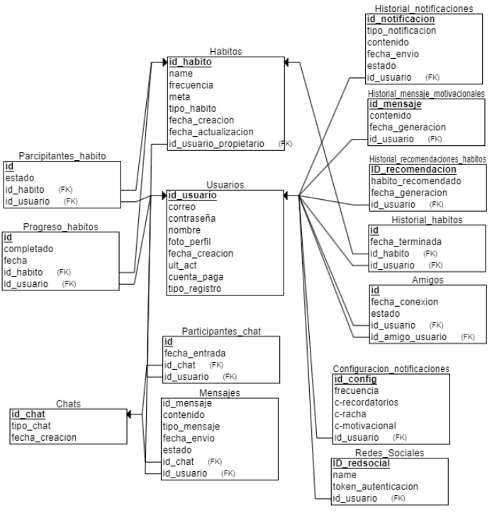
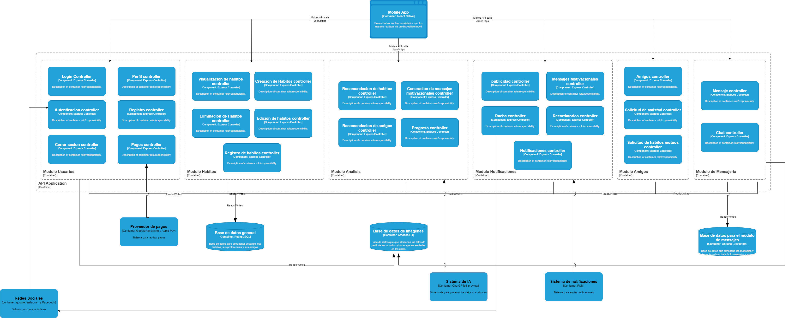

# 9.3. Iteración 2: Identificar estructuras para soportar la funcionalidad primaria

## Paso 2: Establecer el objetivo de la iteracion
El objetivo principal es pasar de una descripción de alto nivel a un nivel de detalle mayor que permita dirigir la implementación. Esto principalmente centrado en el desarrollo de estructuras que soporten la funcionalidad primaria de la aplicacion. En este sentido, se prioriza el desarrollo de las requerimientos funcionales.

## Paso 3: Elegir uno o mas elementos del sistema a refinar
Se eligen refinar los Modulos de Usuario, Habitos, Analisis, Notificaciones, Amigos y Mensajeria, los cuales serán refinados y detallados en esta iteracion

## Paso 4: Elegir uno o mas conceptos de diseño que satisfacen el driver seleccionado

| **Código** | **Decisión de Diseño** | **Fundamentación** |
|------------|------------------------|--------------------|
| DEC-7      | Utilizar un modelo de dominio basado en DDD (Domain-Driven Design) | Se opta por implementar un modelo de dominio que encapsule las principales entidades del sistema (Usuario, Hábito, Notificación, etc.). Este enfoque asegura que la lógica del negocio esté alineada con los requerimientos funcionales y permite un diseño más comprensible para el equipo. |
| DEC-8      | Usar una base de datos relacional para la persistencia de datos | Se opta por una base de datos relacional PostgreSQL para almacenar los datos de los módulos de Usuario y Hábitos. Este tipo de base de datos es adecuado para gestionar relaciones complejas entre entidades y proporciona un rendimiento eficiente para consultas de datos estructurados. |
| DEC-9      | Identificar objetos de dominio que se relacionan con requerimientos funcionales | Se busca encapsular cada elemento funcional de la aplicación con sus objetos de dominio. Esto asegura que cada parte del sistema esté alineada con los requisitos de negocio. |
| DEC-10     | Descomponer los modulos en componentes especializados | Una vez identificados los objetos de dominio, se descomponen a nivel de funcionalidaades especializadas. Esto facilita la gestión de la complejidad, permitiendo que cada módulo sea descompuesto según sus principales requerimientos y responsabilidades. |
| DEC-11     | Utilizar API RESTful para la comunicación entre módulos | Se opta por la implementación de una API RESTful para la comunicación entre los diferentes módulos del sistema. Este enfoque permite que los módulos se comuniquen de manera eficiente, independientemente del cliente o plataforma que se utilice, y facilita la escalabilidad y mantenimiento del sistema. |

## Paso 5: Instanciar elementos de arquitectura, asignar responsabilidades y definir interfaces

| **Código** | **Decisión de Diseño** | **Fundamentación** |
|------------|------------------------|--------------------|
| DEC-9     | Crear solamente el modelo inicial de dominio | Se prioriza un diseño acotado que permita acelerar el proceso inicial de desarrollo, estableciendo las bases necesarias para la evolución futura del sistema. |
| DEC-10      | Relacionar el modelo de dominio para cada módulo | Se crea una instancia para cada módulo principal, como Usuario, Hábito, y Notificación, siguiendo la estructura definida en el modelo de dominio. Esto asegura que cada módulo cuente con su propia entidad que encapsula sus responsabilidades y relaciones. |
| DEC-11     | Asignar responsabilidades a cada componente segun los casos de uso | Se asignan responsabilidades claras y específicas a cada componente del sistema, asegurando que estén alineados con las necesidades funcionales y estructurales del sistema. |
| DEC-12     | Implementar controladores y servicios para manejar la lógica de negocio | Se instancian controladores para manejar las peticiones de los usuarios y servicios para encapsular la lógica de negocio, como la creación de hábitos o el envío de notificaciones. Esto permite mantener el código organizado y seguir una arquitectura en capas. |
| DEC-13     | Definir interfaces claras para la comunicación hacia los módulos | Se definen interfaces bien especificadas para cada módulo, como una API RESTful que permita la interacción hacia los módulos de Usuario, Hábito, etc. Esto facilita la integración entre las diferentes partes del sistema y mejora la flexibilidad. |

Paso 6: Bosquejar vistas y registrar decisiones de diseño.

Modelo de dominio inicial

Descomposicion de modulos segun responsabilidades

## Paso 7: Analizar el diseño actual, revisar objetivo de la iteración y logro del proposito del diseño.

| **No Abordado** | **Parcialmente abordado** | **Completamente abordado** | **Decisión de diseño (actual)** |
|-----------------|---------------------------|----------------------------|---------------------------------|
|                 |                           | UC-01                      | DEC-11                          |
|                 |                           | UC-02                      | DEC-11                          |
|                 |                           | UC-03                      | DEC-11                          |
|                 |                           | UC-04                      | DEC-11                          |
|                 |                           | UC-05                      | DEC-11                          |
|                 |                           | UC-06                      | DEC-11                          |
|                 |                           | UC-07                      | DEC-11                          |
|                 |                           | UC-08                      | DEC-11                          |
|                 |                           | UC-09                      | DEC-11                          |
|                 |                           | UC-10                      | DEC-11                          |
|                 |                           | UC-11                      | DEC-11                          |
|                 |                           | UC-12                      | DEC-11                          |
|                 |                           | UC-13                      | DEC-11                          |
|                 |                           | UC-14                      | DEC-11                          |
|                 |                           | UC-15                      | DEC-11                          |
|                 |                           | UC-16                      | DEC-11                          |
|                 |                           | UC-17                      | DEC-11                          |
|                 |                           | UC-18                      | DEC-11                          |
|                 |                           | UC-19                      | DEC-11                          |
|                 |                           | UC-20                      | DEC-11                          |
|                 |                           | UC-21                      | DEC-11                          |
|                 |                           | UC-22                      | DEC-11                          |
|                 |                           | UC-23                      | DEC-11                          |
|                 |                           | UC-24                      | DEC-11                          |
|                 |                           | UC-25                      | DEC-11                          |
|                 |                           | UC-26                      | DEC-11                          |
|                 |                           | UC-27                      | DEC-11                          |
|                 |                           | UC-28                      | DEC-11                          |
|                 |                           | UC-29                      | DEC-11                          |
|                 |                           | UC-30                      | DEC-11                          |
|                 |                           | UC-31                      | DEC-11                          |
|                 |                           | UC-32                      | DEC-11                          |
|                 |                           | UC-33                      | DEC-11                          |
|                 |                           | CON-01                     | DEC-11                          |
|                 | CON-02                    |                            | DEC-11                          |
|                 |                           | CON-03                     | DEC-8                           |
